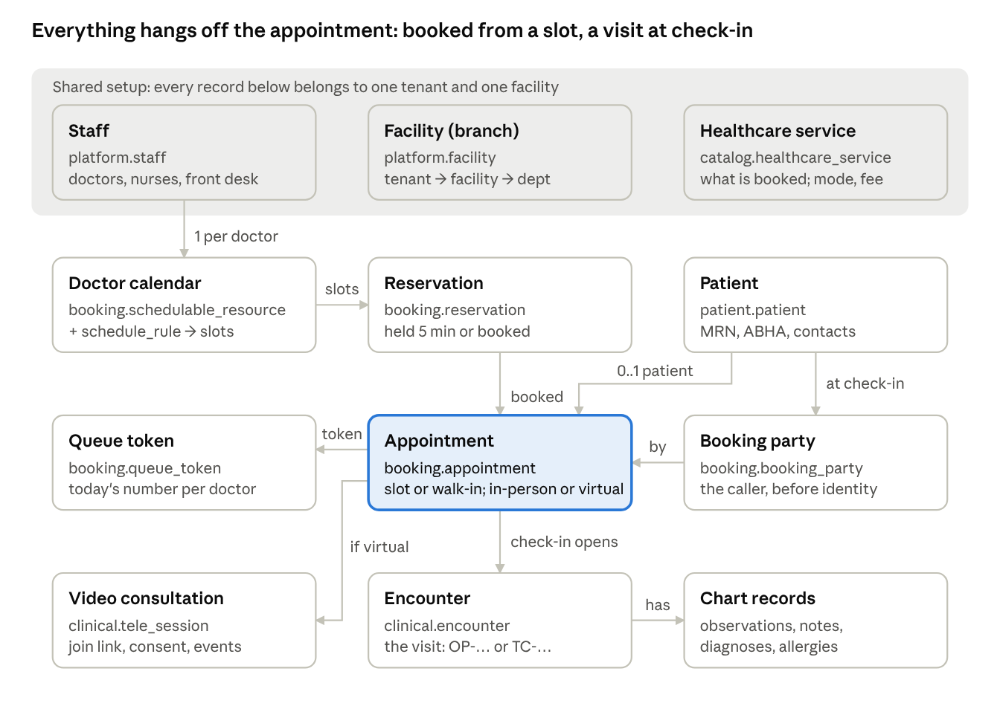
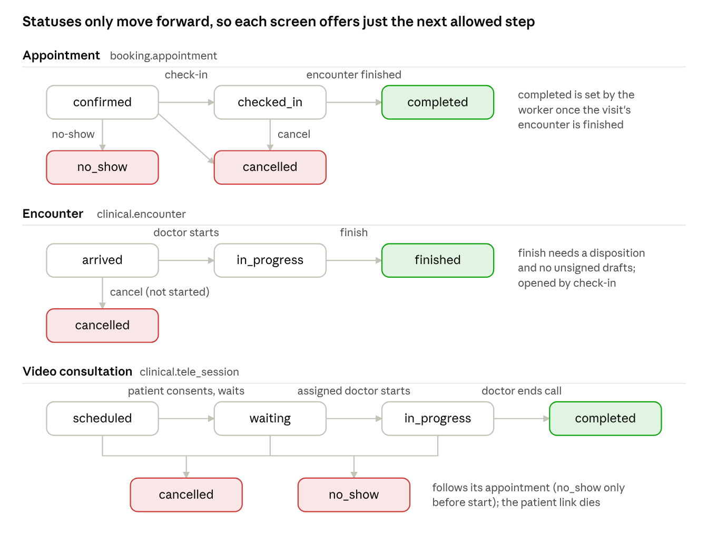

# HMS_NEW — Frontend Developer Guide

As of 2026-10-10. The HMS_NEW backend is ready for the admin dashboard covering five areas: front-desk booking, the queue, doctor consultations, patient records and Virtual OPD (video consultations). Everything lives in this repo under `HMS_NEW/` on `main`. The backend has 117 passing tests.

## Start here

There will be **two separate front-ends**. Know which one you are building:

| Front-end | Who uses it | Login | Status |
| --- | --- | --- | --- |
| **Admin dashboard** (staff app, hosted separately) | Front desk, doctors, nurses, admins | Bearer token from an external identity provider (OIDC). Locally: a dev token | **Build this now** — every `/v1` API in this guide is for it |
| **Exora webpage** (patient-facing site; today's code is in `hospital-webpage/`, moving to `HMS_NEW/apps/website`) | Patients | None (booking by name + phone) | Its public API (`/public/v1`) is planned, not built. Only the patient video-consult page can be built today (`/tele/v1`) |

**What the backend covers today:**

- Organisation and staff: hospitals (tenants), branches (facilities), departments, staff, roles and permissions per branch
- Patients: registration, search, demographics
- Doctor directory and calendars: weekly sessions, leave and exceptions, holidays
- Booking: free slots, holds, booking, reschedule, cancel, no-show, check-in, walk-ins, queue tokens
- Clinical: encounters, vitals, versioned and signed notes from templates, diagnoses, problem list, allergies, chart privacy, break-glass access
- Virtual OPD: teleconsultations, patient join links, consent, Jitsi video tokens

**Not built yet:**

- Lab and imaging orders
- Pharmacy, inventory and prescriptions
- Billing and payments
- Inpatient and beds
- Notifications (SMS / WhatsApp)
- Document uploads
- Reports
- The public website API

Don't build screens for these yet.

**Run it locally.** You need Node 22.12+ and pnpm 10. No Docker is needed: Postgres 18 runs embedded.

```bash
cd HMS_NEW
pnpm install
pnpm pg:start        # local PostgreSQL on port 54329
pnpm db:reset        # create, migrate and load demo data
pnpm api:dev         # API on http://127.0.0.1:3000
pnpm worker:dev      # second terminal: background jobs (needed — see Backend architecture)
```

The API allows browser calls from `http://localhost:5173` (Vite's default). Change this with `CORS_ORIGINS` in `HMS_NEW/.env`. To sign in locally, call `POST /dev/login` with `{"subject":"ravi"}` and use the returned token as `Authorization: Bearer <token>`.

**Reference files in the repo:**

- `HMS_NEW/docs/api/README.md`: every endpoint
- `HMS_NEW/docs/design/erd-v2/`: full ERD, 17 modules
- `HMS_NEW/docs/plan/`: build plans, including the Virtual OPD and website plans
- `HMS_NEW/packages/db/src/generated/db.ts`: TypeScript types of every table

## The data model (ERD) in plain terms

The whole hospital is one chain: a **patient** books an **appointment** with a **doctor**. Check-in opens an **encounter**, and everything clinical hangs off the encounter. The full ERD has 17 modules. Five are built.



Read it top to bottom. A doctor's calendar produces slots; booking one turns a held reservation into an appointment. Check-in links the patient and issues a token, and the worker opens the encounter. A virtual appointment also gets a video consultation.

| Module (DB schema) | What it holds | Key tables |
| --- | --- | --- |
| Platform (`platform`) | Hospital groups, branches, departments, rooms, staff and who may do what | `tenant`, `facility`, `department`, `location`, `staff`, `staff_registration`, `user_account`, `role`, `permission`, `role_grant`, `care_assignment`, `emergency_access_grant`, `audit_event` |
| Patient (`patient`) | People being treated | `patient` (with MRN), `patient_identifier` (ABHA, Aadhaar…), `patient_address`, `patient_contact`, `related_person`, `patient_consent`, `patient_flag` |
| Catalogue (`catalog`) | What the hospital offers and charges | `specialty`, `practitioner_profile`, `practitioner_affiliation`, `healthcare_service`, `service_item`, `price_list`, `price_list_item`, `observation_definition` |
| Booking (`booking`) | Doctor calendars, slots, appointments, queue | `schedulable_resource`, `schedule_rule`, `schedule_exception`, `facility_holiday`, `reservation`, `booking_party`, `appointment`, `queue_token` |
| Clinical (`clinical`) | The chart, plus video consultations | `encounter`, `encounter_participant`, `observation`, `clinical_note` + `clinical_note_version`, `condition`, `encounter_diagnosis`, `allergy_intolerance`, `tele_session`, `tele_consent`, `tele_consent_document` |

**Terms you will see in API responses:**

- **Tenant**: one customer hospital or group. All data is per tenant, and your token decides the tenant.
- **Facility**: a branch, e.g. "Demo Health Bengaluru". Permissions are granted per facility.
- **Staff**: a person who works for the tenant. A doctor is staff with `staffType: "doctor"`; their public profile is a `practitioner_profile`.
- **Healthcare service**: what is booked, e.g. "General Medicine OPD". Its mode is in-person, virtual or both, and it is linked to a price.
- **Schedule rule**: a weekly session, e.g. "Mondays 09:00–13:00, 15-minute slots". **Slots are calculated from these, never stored.**
- **Reservation**: a slot taken, either `held` (5 minutes while booking) or `booked`. The database makes double-booking impossible.
- **Booking party**: whoever booked, e.g. a relative or a caller. It can exist before the patient is identified. The **patient** record (with MRN) is attached at check-in.
- **Appointment**: a booking. `bookingKind` is `slot` or `walk_in`; `visitMode` is `in_person` or `virtual`.
- **Queue token**: the number a patient gets at check-in, per doctor per day.
- **Encounter**: the clinical visit, numbered `OP-000123` for an outpatient visit or `TC-…` for a video one. It holds vitals (**observations**), **notes**, **diagnoses** and **allergies**.
- **Tele session**: the video-call side of a virtual appointment.

## How the database is built (and what it means for the UI)

The database enforces the important rules itself, so a UI bug cannot corrupt data. You will see these rules come back as clean API errors.

| Database rule | What you see in the UI |
| --- | --- |
| **One database, many hospitals.** Every row carries `tenant_id`, and row-level security hides other tenants' rows. | You never send a tenant id in bodies. A user in several tenants sends `X-Tenant-Id`. Another tenant's ids return **404**, not 403. |
| **No double booking.** An exclusion constraint on `reservation` rejects overlapping holds or bookings for the same doctor. | Two people grabbing one slot: one gets **409** (`slot_unavailable`). Show "just taken, pick another time" and refresh slots. |
| **Optimistic locking.** Most rows have a `version` that goes up on every change. | Where the API asks for `baseVersion` (notes), a stale edit gets **409**: reload and redo. |
| **Allowed status changes only.** Database triggers guard appointment, encounter and tele-session statuses. | Only show the actions the current status allows (see Status flows). The rest return **422**. |
| **History is append-only.** Status histories, audit log, signed notes, consent records and tele events can't be edited or deleted. | There is no "delete". Corrections are new records: an amended note, a corrected vital, "entered in error". |
| **Every change is audited**, with who, when and why. Sensitive reads (chart views) are audited too. | Ask for a reason where the API needs one: cancel, break-glass, amendment, correction. |
| **Numbers come from the database**: MRN, encounter no., token no., confirmation code. | Display them; never generate them in the UI. |
| **Each module writes only its own tables.** Modules talk to each other through events (next section). | Some effects arrive a second later, not in the same response. |

**Data formats:**

- Ids are UUIDs (v7, roughly time-ordered).
- Timestamps are ISO 8601 with offset; send them as `2026-10-17T14:00:00+05:30`.
- Dates are `YYYY-MM-DD`; times of day are `HH:MM` in the branch's local time (Asia/Kolkata).
- Money is integer **paise** in `…Minor` fields, e.g. `feeMinor: 50000` = ₹500.00.
- Phone numbers are E.164, e.g. `+919876543210`.

## Backend architecture

There are two processes over one PostgreSQL 18 database, and the UI talks only to the API.

- **API** (`apps/api`): Fastify 5 + TypeScript and Kysely, with plain SQL migrations. Every write runs as one transaction that checks permission, makes the change, writes the audit row and writes an **event** to an outbox table.
- **Worker** (`apps/worker`): reads the outbox and runs follow-up steps in other modules, each exactly once with retries. It also expires lapsed slot holds every 30 seconds.

**Why this matters to you:** some results appear **about a second after** the action that caused them, and only while the worker is running. Poll, or refetch after a short delay:

| You do | The worker then | Poll |
| --- | --- | --- |
| Check a patient in | Opens the encounter (`OP-…` / `TC-…`) | `GET /v1/appointments/:id/encounter` until 200 |
| Finish the encounter | Marks the appointment `completed` and the queue token done | `GET /v1/appointments/:id` |
| Cancel a checked-in appointment | Cancels the encounter if it hasn't started | — |
| Book a virtual slot | Creates the tele session | `GET /v1/appointments/:id/teleconsult` (or just issue the link: it creates the session if missing) |
| Cancel / no-show a virtual appointment | Closes the tele session and kills the patient link | — |
| Patient enters the video waiting room | Checks the appointment in, if the patient record is linked; that then opens the encounter | `GET /v1/teleconsults/:id` until `appointmentStatus` is `checked_in` |

**Idempotency.** Create-type actions (marked 🔑 in the reference) need an `Idempotency-Key` header. Make one with `crypto.randomUUID()` **per user action**. Reuse it if you retry that same action, e.g. after a network timeout, so a double-click or a retry never books twice.

## Login, permissions and demo users

The admin dashboard sends `Authorization: Bearer <token>` on every `/v1` call, then calls `GET /v1/me` to learn who is signed in and what they may do.

**Login.** In production, tokens come from an external OIDC identity provider; which one is still open (Keycloak, Auth0, Azure AD B2C or Google Workspace). Use a standard OIDC library with authorization code + PKCE. Locally, use `POST /dev/login {"subject":"asha"}`. A token's issuer + subject must match a staff user account, otherwise the API returns 403.

**Build menus from `/v1/me`.** It returns `staffId`, `displayName`, `staffType`, `tenantId` and `permissions`. `permissions` maps each permission to the facility ids it applies to, where `"*"` means every facility:

```json
{ "staffId": "01920000-…-0404", "displayName": "Ravi Shankar", "staffType": "admin",
  "permissions": { "appointments.book": ["01920000-…-0101"], "teleconsult.manage": ["01920000-…-0101"] } }
```

Show a screen or button only when the user holds its permission **for the facility on screen**. A role granted at one branch doesn't work at another. The API checks again anyway and returns 403 with `details.permission`.

**Chart privacy** is a second check on top of permissions: a doctor or nurse opens a patient's chart only with a **care relationship**. That means they take part in one of the patient's encounters (open, or ended within 30 days), or have a care assignment. Staff with clinical permissions join an *active* encounter automatically when they work on it. Otherwise the API returns 403 with `reason: no_care_relationship`. In that case offer **break-glass** (`POST /v1/patients/:id/break-glass`, reason of at least 10 characters, 1–24 hours, audited and reviewed).

| Built-in role | Main permissions |
| --- | --- |
| `front_desk` | patients read/register/update, consents, appointments book/reschedule/cancel/check-in, queue, encounter worklist, teleconsult read + issue links |
| `doctor` | patients read/update, flags, consents, appointments read, queue, encounters manage, clinical read/write/sign, teleconsult read + conduct, break-glass |
| `nurse` | patients read, flags, consents, appointments read + check-in, queue, encounters manage, clinical read/write, teleconsult read, break-glass |
| `tenant_admin` | everything except break-glass, including `schedules.manage` |
| `auditor` | audit log, break-glass review, read-only lists |

**Demo logins** (dev only; tenant "Demo Health", Bengaluru facility `01920000-0000-7000-8000-000000000101`):

| Subject | Person | Use it to test |
| --- | --- | --- |
| `ravi` | Ravi Shankar, front desk (Bengaluru) | Registration, booking, check-in, queue, video links |
| `asha` | Dr Asha Rao, General Medicine, staff id `…0401`. Mon–Sat 09:00–13:00 slots, Mon–Fri 17:00–19:00 walk-ins, **Sat 14:00–16:00 video OPD** | Doctor console, notes and signing, video calls |
| `meena` | Meena Kumari, nurse (Bengaluru) | Vitals, nursing notes |
| `priya` | Priya Nair, tenant admin | Schedules, everything else |

Dr Vikram Iyer (Paediatrics, `…0402`) has a calendar but no login.

## API conventions

The API speaks JSON over HTTP. Lists come back as `{ "items": [...] }`. Errors always have the same shape, so one error handler covers the whole app:

```json
{ "error": { "code": "precondition_failed", "message": "the hold on this slot has expired or was released; pick a slot again", "details": { "reason": "hold_expired" } }, "requestId": "…" }
```

**Branch on `error.details.reason`, not on the message.** Messages are for logs and fallback text.

| HTTP | `error.code` | Meaning | UI response |
| --- | --- | --- | --- |
| 400 | `validation` | Bad input; `details.issues` = `[{path, message}]` | Mark the fields |
| 401 | `unauthenticated` | Token missing or expired | Refresh the token or send to login |
| 403 | `forbidden` | Missing permission (`details.permission`), not the assigned doctor, no care relationship | Hide the action; offer break-glass on chart 403s |
| 404 | `not_found` | Not found, or belongs to another tenant | "Not found" |
| 409 | `conflict` / `idempotency_conflict` | Someone got there first: `slot_unavailable`, `walk_ins_full`, stale `baseVersion` | Refresh, then let them retry |
| 422 | `precondition_failed` | Valid request, wrong moment: `hold_expired`, `patient_required`, `no_session`, `patient_not_checked_in`, `consent_required`, `too_early`… | Explain what to do next |
| 500 | `internal` | Bug | Show `requestId` so support can trace it |

**Request headers:**

| Header | When |
| --- | --- |
| `Authorization: Bearer <token>` | Every `/v1` call |
| `Idempotency-Key: <uuid>` | 🔑 endpoints: holds, appointments, reschedule, check-in, walk-ins, patients, encounters, notes |
| `X-Tenant-Id: <uuid>` | Only when one login has accounts in several hospitals |
| `X-Request-Id: <uuid>` | Optional; echoed back and stored on the audit log for tracing |
| `X-Teleconsult-Token: <token>` | Patient video page only (`/tele/v1`) |

TypeScript types for every table are in `HMS_NEW/packages/db/src/generated/db.ts`. There is no OpenAPI file yet: response shapes are in `HMS_NEW/docs/api/README.md` and the route files under `apps/api/src/http/routes/`.

## Endpoint reference

The base URL locally is `http://127.0.0.1:3000`. 🔑 means `Idempotency-Key` is required. "@ facility" means the permission must cover the branch involved.

**Session and directory**

| Call | Permission | Use |
| --- | --- | --- |
| `GET /v1/me` | any | Who is signed in, and their permissions per facility |
| `GET /v1/facilities` | `catalog.read` | Branch picker |
| `GET /v1/practitioners?facilityId&specialty` | `catalog.read` | Doctor picker, with current affiliations |
| `GET /health` · `GET /ready` | none | Status page / ops |

**Patients**

| Call | Permission | Use |
| --- | --- | --- |
| `GET /v1/patients?q=` or `?phone=` or `?abhaNumber=` | `patients.read` | Search. `q` (2+ characters) is typo-tolerant on name and also matches MRN |
| `GET /v1/patients/:id` | `patients.read` | Patient header: demographics, identifiers, contacts |
| `POST /v1/patients` 🔑 | `patients.register` @ `registeredFacilityId` | Register. Body: `givenName`, `sex`, `registeredFacilityId`, `source`, optional `familyName`, `birthDate`, `phone`, `abhaNumber`. Returns `patientId`, `mrn` |

**Doctor calendars** (admin screens)

| Call | Permission | Use |
| --- | --- | --- |
| `POST /v1/practitioners/:staffId/calendar` | `schedules.manage` | Create the doctor's calendar (safe to repeat) |
| `POST /v1/practitioners/:staffId/weekly-sessions` | `schedules.manage` @ facility | `{facilityId, weekday 1–7, start, end, slotMinutes?, maxWalkInTokens?, healthcareServiceId?, visitMode?, effectiveFrom}` |
| `POST /v1/weekly-sessions/:id/end` | `schedules.manage` | Stop a weekly session from a date |
| `POST /v1/practitioners/:staffId/exceptions` | `schedules.manage` | Leave (`closed`), `block`, `extra_hours`. The response lists clashing appointments to rebook |
| `POST /v1/facilities/:facilityId/holidays` | `schedules.manage` @ facility | Holiday; also lists clashes |
| `PUT /v1/practitioners/:staffId/day-plans/:date` | `schedules.manage` | Replace one day's plan |
| `GET /v1/practitioners/:staffId/sessions?from&to` | `appointments.read` | Calendar view: effective sessions per day |
| `GET /v1/practitioners/:staffId/slots?from&to&facilityId&includeUnavailable` | `appointments.read` | Slot grid, up to 31 days. Each slot has `slotStart`, `slotEnd`, `facilityId`, `visitMode`, `status` |

**Booking and front desk**

| Call | Permission | Use |
| --- | --- | --- |
| `POST /v1/holds` 🔑 | `appointments.book` | `{staffId, slotStart}` → `{reservationId, holdExpiresAt}` (5 minutes) |
| `DELETE /v1/holds/:reservationId` | `appointments.book` | User backed out |
| `POST /v1/appointments` 🔑 | `appointments.book` @ facility | `{reservationId, patientId? and/or bookingParty {name, phone or email}, originChannel, visitType?, priority?, reason?}` → `confirmationCode`, `feeMinor` |
| `GET /v1/appointments?from&to&facilityId&staffId&patientId&status` | `appointments.read` | Day list / diary. Staff limited to some branches must pass `facilityId` |
| `GET /v1/appointments/:id` | `appointments.read` | Detail, with patient, booker and token |
| `POST /v1/appointments/:id/cancel` | `appointments.cancel` | `{reason}` |
| `POST /v1/appointments/:id/reschedule` 🔑 | `appointments.reschedule` | Hold the new slot first, then `{newReservationId, reason?}` |
| `POST /v1/appointments/:id/no-show` | `appointments.check_in` | Only after the slot has ended |
| `POST /v1/appointments/:id/check-in` 🔑 | `appointments.check_in` | `{patientId?}` (needed if the booking isn't linked to a patient yet). Only on the day. → `tokenNo` |
| `POST /v1/walk-ins` 🔑 | `appointments.check_in` | `{staffId, facilityId, patientId, priority?}`. Straight into today's queue, capacity-limited |

**Queue**

| Call | Permission | Use |
| --- | --- | --- |
| `GET /v1/queue?staffId&facilityId&date` | `appointments.read` | Queue board, in calling order |
| `POST /v1/queue/call-next` | `queue.manage` | Next patient: emergency, then VIP, then senior, then normal, each by token. **204** when the queue is empty |
| `POST /v1/queue-tokens/:id/start` · `/complete` · `/skip` | `queue.manage` | Token progress |

**Clinical** (doctor and nurse screens)

| Call | Permission | Use |
| --- | --- | --- |
| `GET /v1/encounters?facilityId&date&staffId&status` | `encounters.read` | Doctor's worklist (no chart contents) |
| `GET /v1/appointments/:id/encounter` | `encounters.read` | Find the encounter opened by check-in |
| `POST /v1/encounters` 🔑 | `encounters.manage` | Unscheduled or emergency visit |
| `GET /v1/encounters/:id` | `clinical.read` + care | Consultation screen: vitals, notes, diagnoses, allergies, problems |
| `POST /v1/encounters/:id/start` | `encounters.manage` | Doctor starts the consultation |
| `POST /v1/encounters/:id/finish` | `encounters.manage` | `{disposition, followUpAdvisedOn?}`. Fails while draft notes remain |
| `POST /v1/encounters/:id/cancel` | `encounters.manage` | `{reason}` |
| `POST /v1/encounters/:id/participants` | `encounters.manage` | `{staffId, role}` |
| `POST /v1/encounters/:id/vitals` | `clinical.write` | `{values: [{code, value}]}`. Codes: `BP_SYS`, `BP_DIA`, `PULSE`, `RESP`, `TEMP`, `SPO2`, `WEIGHT`, `HEIGHT`, `BMI` |
| `POST /v1/observations/:id/correct` | `clinical.write` | `{reason, value?}` (no value = entered in error) |
| `GET /v1/note-templates` | `clinical.read` | Form definitions, e.g. `opd_consultation` (SOAP) |
| `POST /v1/encounters/:id/notes` 🔑 | `clinical.write` | `{noteType, templateCode?, data?, narrative?}` → draft v1 |
| `PUT /v1/notes/:id` | `clinical.write` | `{baseVersion, data?, narrative?, amendmentReason?}`. Autosave target |
| `POST /v1/notes/:id/sign` | `clinical.sign` | Author only; needs a valid council registration |
| `POST /v1/notes/:id/entered-in-error` | `clinical.write` | `{reason}` |
| `POST /v1/encounters/:id/diagnoses` | `clinical.write` | Add a diagnosis (one primary per encounter) |
| `PATCH /v1/conditions/:id` | `clinical.write` + care | Problem-list status |
| `GET /v1/patients/:id/chart` | `clinical.read` + care | Patient summary |
| `POST /v1/patients/:id/allergies` · `PATCH /v1/allergies/:id` | `clinical.write` + care | Allergies |
| `POST /v1/patients/:id/break-glass` | `break_glass.use` | `{reason (10+ characters), hours 1–24}` |

**Virtual OPD: staff**

| Call | Permission | Use |
| --- | --- | --- |
| `GET /v1/teleconsults?facilityId&date&staffId&status` | `teleconsult.read` | Video worklist: status, consent, waiting since, link state, encounter |
| `GET /v1/teleconsults/:id` · `GET /v1/appointments/:id/teleconsult` | `teleconsult.read` | Detail plus timeline (`events`) |
| `POST /v1/appointments/:id/teleconsult/link` | `teleconsult.manage` | → `{token, url, expiresAt}`. Shown **once**; re-issuing kills the old link |
| `POST /v1/teleconsults/:id/consent` | `consents.record` | Verbal consent: `{documentVersion, note}` |
| `POST /v1/teleconsults/:id/start` | `teleconsult.conduct` + assigned doctor | Appointment must be checked in |
| `POST /v1/teleconsults/:id/join` | same | → `{domain, roomName, jwt, expiresAt, role: "moderator"}` |
| `POST /v1/teleconsults/:id/identity` | same | `{method: known_patient \| photo_id \| abha \| verified_by_staff, note?}` |
| `POST /v1/teleconsults/:id/end` | same | `{outcome: consulted \| patient_did_not_join \| technical_failure, note?}` |

**Virtual OPD: patient page** (on the Exora webpage; header `X-Teleconsult-Token`, no login)

| Call | Use |
| --- | --- |
| `GET /tele/v1/session` | Everything the page needs, including `next` (what to show) and `retryAfterSeconds` (when to poll) |
| `POST /tele/v1/session/consent` | `{documentVersion, accepted: true}` |
| `POST /tele/v1/session/check-in` | Enter the waiting room |
| `POST /tele/v1/session/join` | → participant Jitsi grant |
| `POST /tele/v1/session/leave` | Patient closed the call |

## Screens to build, and the calls behind them

Build these in order. Each one can be tested end to end on the demo data today.

**1. Sign-in and shell** (admin dashboard)

1. Sign in: OIDC, or locally `POST /dev/login`.
2. Call `GET /v1/me` and keep the result. Build the navigation from `permissions`.
3. Add a branch picker from `GET /v1/facilities`, filtered to branches the user has permissions for.

**2. Patient search and registration** (front desk)

1. Search box: `GET /v1/patients?q=` (debounced, 2+ characters), or by phone or ABHA.
2. No match: show the register form, then `POST /v1/patients` with a new `Idempotency-Key`. Show the returned `mrn`.
3. Patient header: `GET /v1/patients/:id`.

**3. Book an appointment** (front desk)

1. Pick a doctor: `GET /v1/practitioners?facilityId=`.
2. Slot grid: `GET /v1/practitioners/:staffId/slots?from&to&facilityId`. Show `free` slots and mark `virtual` ones with a video icon.
3. On click, `POST /v1/holds` and show a 5-minute countdown from `holdExpiresAt`.
    - 409 `slot_unavailable`: refresh the grid.
4. Confirm with `POST /v1/appointments`, using the registered `patientId` or a `bookingParty` (name + phone) for an unknown caller. Show `confirmationCode` and the fee (`feeMinor` ÷ 100).
    - 422 `hold_expired`: start again.
5. Cancelling the dialog calls `DELETE /v1/holds/:reservationId`.

**4. Day list and check-in** (front desk)

1. List: `GET /v1/appointments?from=today&to=today&facilityId=`, filtered by doctor or status.
2. Check in: `POST /v1/appointments/:id/check-in`. If the appointment has no patient yet, search or register first and send `{patientId}`. Show the `tokenNo`.
    - 422 `patient_required`: you skipped linking the patient.
3. Row actions: cancel (reason), reschedule (hold a new slot, then reschedule), no-show (only after the slot has ended).
4. Walk-in button: `POST /v1/walk-ins`.
    - 409 `walk_ins_full`; 422 `no_walk_ins` or `no_session`.

**5. Queue board** (front desk / doctor)

- `GET /v1/queue?staffId&facilityId&date`; refresh every 10–15 s.
- Buttons: call next (204 = queue empty), start, complete, skip.

**6. Doctor console**

1. Worklist: `GET /v1/encounters?facilityId&date&staffId=<me>`.
2. Open a visit: `GET /v1/encounters/:id`, then `POST /v1/encounters/:id/start`.
3. Vitals panel: `POST /v1/encounters/:id/vitals`. To fix a value, use correct, never edit.
4. Notes: `GET /v1/note-templates` renders the SOAP form.
    - Create the draft with `POST /v1/encounters/:id/notes`.
    - Autosave with `PUT /v1/notes/:id`, sending the last `currentVersion` as `baseVersion`. A 409 means another tab saved: reload.
    - Sign with `POST /v1/notes/:id/sign`. A signed note is locked; later changes need `amendmentReason`.
5. Diagnoses and allergies panels, and the patient summary from `GET /v1/patients/:id/chart`.
6. Finish: `POST /v1/encounters/:id/finish` with a disposition. It fails while drafts are unsigned. The worker then completes the appointment.
7. A 403 `no_care_relationship` on an old chart: offer the break-glass dialog.

**7. Virtual OPD: doctor and front desk**

1. Video worklist: `GET /v1/teleconsults?facilityId&date&staffId=<me>`. Poll every 5–10 s on the day. Show `status`, `consented`, `patientWaitingSince` and `appointmentStatus`.
2. Front desk, "Send video link": `POST /v1/appointments/:id/teleconsult/link`.
    - Show `url` with a copy button once. It is never shown again; send it to the patient by WhatsApp or SMS by hand for now.
    - "Resend" issues a new link and kills the old one.
3. Patient is waiting and `appointmentStatus` is `checked_in`: enable **Start**, which calls `POST /v1/teleconsults/:id/start`.
    - If the booking has no patient record, the front desk must check them in first (screen 4). Until then, start returns 422 `patient_not_checked_in`.
4. Then call `POST /v1/teleconsults/:id/join` and embed Jitsi with the grant (snippet below).
    - Grants last 5 minutes. On reconnect, call join again.
    - Keep the encounter screen (screen 6) open beside the video. `encounterId` is in the teleconsult response.
5. During the call: an "Identity confirmed" control (method + note) calls `POST /v1/teleconsults/:id/identity`.
6. End the call with `POST /v1/teleconsults/:id/end`.
    - `consulted` needs identity first; the other outcomes need a note.
    - Then finish the encounter as in screen 6. Ending the call does **not** finish the visit.

**8. Virtual OPD: patient page** (Exora webpage, e.g. `/video-consult`)

1. Read the token from the URL fragment (`#t=…`), keep it in memory, and remove it from the address bar with `history.replaceState`. Send it as `X-Teleconsult-Token`.
2. Call `GET /tele/v1/session` and render by `next`:

| `next` | Show |
| --- | --- |
| `accept_consent` | Consent text (`consent.document.title` / `body`) + "I agree", which posts `/consent` with `consent.document.version` |
| `wait_for_start_time` | "Your consultation with Dr X opens at `joinOpensAt`" |
| `enter_waiting_room` | Camera/mic check (`getUserMedia`), then "Enter waiting room", which posts `/check-in` |
| `wait_for_doctor` | "The doctor will start shortly"; poll every `retryAfterSeconds` |
| `join` | Posts `/join` and embeds Jitsi as participant |
| `closed` / `unavailable` | Consultation ended or cancelled / video not available |

3. A 403 `invalid_link` means the link is wrong, expired or replaced. Tell the patient to contact the hospital.
4. When they hang up, post `/leave`. They can rejoin while the doctor hasn't ended the call.

**Embedding Jitsi** (both sides):

```js
// load https://<grant.domain>/external_api.js once, then:
const api = new JitsiMeetExternalAPI(grant.domain, {
  roomName: grant.roomName,
  jwt: grant.jwt,
  parentNode: document.getElementById('video'),
  userInfo: { displayName: grant.displayName },
  configOverwrite: { prejoinPageEnabled: false, disableDeepLinking: true },
});
api.addListener('videoConferenceLeft', onHangup);
```

Locally there is no Jitsi server, so grants are minted for `meet.localhost` and the video won't connect. Build and test the flow up to the join call, and mock the video area. A self-hosted Jitsi with token login is needed for real calls (see Open questions).

## Status flows

Each record moves only forward, and the database rejects any other move. Show only the buttons for the next allowed step; green is the normal end, red the early exits.



The three are linked. Check-in opens the encounter. Finishing the encounter completes the appointment. A video patient entering the waiting room checks the appointment in, if their record is linked. The doctor can also start a video call straight from `scheduled` once the front desk has checked the patient in. An encounter can also be marked `entered_in_error`.

## Gotchas, gaps and open questions

**Gotchas:**

- **Run the worker.** Without `pnpm worker:dev`, nothing that happens after an action happens: no encounter after check-in, no "completed" after finish, no tele session after a virtual booking.
- **Clock and time zone.** Check-in only works on the appointment's day, in the branch's local calendar. On demo data, book for today or use the next Monday–Saturday.
- **Facility-scoped users.** Ravi's role covers Bengaluru only. Lists like `GET /v1/appointments` need `facilityId` for him, or they return 403.
- **Never cache link responses.** The teleconsult link is shown once. Don't put it in logs, analytics or localStorage.
- **Unknown callers.** A booking with only a `bookingParty` has no `patientId` until check-in. Show `bookingParty.name` / `phone` instead of an MRN.
- **The UI doesn't decide which actions are allowed.** The server re-checks permissions, states and time windows. Use the error `reason` to explain.

**Not built yet, so don't build screens for it:**

- Lab and imaging orders and results
- Prescriptions, pharmacy, inventory
- Billing, invoices, payments
- Inpatient admissions and beds
- Notifications (SMS / WhatsApp sending)
- Document and photo upload
- Reports and dashboards with totals
- Staff and role administration screens: the tables exist, the API doesn't yet
- The Exora webpage's public booking API

**Open questions (for the team):**

- Which OIDC identity provider? This decides the login library and its config.
- Jitsi: will the hospital self-host Jitsi with token login? Without it, video calls don't connect.
- Exora webpage: the public booking API (`/public/v1`) is planned in `HMS_NEW/docs/plan/WEBSITE_PLAN.md` and not started.
- The consent text in the demo is a **sample**; real wording needs legal sign-off before go-live.
