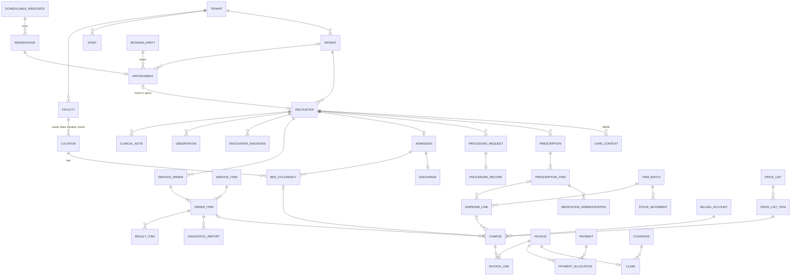

# HMS ERD v2 — merged full-system design

Supersedes `../erd/` (v1). Merges three sources:
1. **v1 layered ERD** (this repo) — India compliance, database-enforced invariants.
2. **"HMS ERD Review: Plan Alignment and Medplum Mapping"** (@sachin, 2026-10-09) — gap findings against flows F01–F21.
3. **"HMS Full-System ERD and Module Flows" (AGNOSTIC)** (@sachin, 2026-10-09) — 16-module, 170-table standalone model.

Result: **17 modules, ~230 tables**, PostgreSQL 18, standalone (no Medplum), shared DB + RLS, India (ABDM, NHCX, GST, DPDP).

| # | Module | Schema | File |
|---|---|---|---|
| — | Conventions | — | [00-conventions.md](00-conventions.md) |
| M01 | Platform, organisation & access | `platform` | [m01-platform.md](m01-platform.md) |
| M02 | Patient registry | `patient` | [m02-patient.md](m02-patient.md) |
| M03 | Directory, catalogue, terminology & pricing | `catalog` | [m03-catalog.md](m03-catalog.md) |
| M04 | Scheduling & booking | `booking` | [m04-booking.md](m04-booking.md) |
| M05 | Encounters, emergency & clinical docs | `clinical` | [m05-clinical.md](m05-clinical.md) |
| M06 | Orders, lab & imaging | `diagnostics` | [m06-diagnostics.md](m06-diagnostics.md) |
| M07 | Inpatient, beds, discharge, housekeeping | `inpatient` | [m07-inpatient.md](m07-inpatient.md) |
| M08 | Theatre & procedures | `theatre` | [m08-theatre.md](m08-theatre.md) |
| M09 | Pharmacy & medication administration | `pharmacy` | [m09-pharmacy.md](m09-pharmacy.md) |
| M10 | Inventory & procurement | `inventory` | [m10-inventory.md](m10-inventory.md) |
| M11 | Billing, cashier & ledger | `billing` | [m11-billing.md](m11-billing.md) |
| M12 | Insurance, TPA & schemes | `insurance` | [m12-insurance.md](m12-insurance.md) |
| M13 | Communications & growth | `comms` | [m13-comms.md](m13-comms.md) |
| M14 | Documents & support | `documents` | [m14-m16-documents-ops-integration.md](m14-m16-documents-ops-integration.md) |
| M15 | Workforce, work queues, facility services | `operations` | same file |
| M16 | Integration, reconciliation & reporting | `integration` | same file |
| M17 | ABDM & FHIR interoperability | `abdm` | [m17-abdm.md](m17-abdm.md) |

## Medplum decision: standalone PostgreSQL

**Verdict for this product: Medplum as the system of record is a net cost, not a plus.** Use plain PostgreSQL as the single source of truth and generate FHIR only where it is needed (M17 for ABDM, M12 for NHCX).

| | Medplum owns clinical data | Standalone (chosen) |
|---|---|---|
| Atomic writes | Clinical in Medplum, money/stock/booking in SQL → **no transaction spans both**; needs outbox + `source_resource_map` + reconciliation for every cross-store link (the review's own finding) | One transaction: chart + charge + stock + audit + outbox commit together |
| Integrity | References checked only if `checkReferencesOnWrite` is enabled (it was off in the demo); no FKs into SQL | Real FKs, exclusion constraints, CHECKs |
| India needs | MLC, PC-PNDT, H1 registers, GST, beds/housekeeping are not FHIR-native → custom extensions or SQL anyway | Modelled directly |
| ABDM / NHCX | FHIR-native storage, but ABDM still needs NRCeS-profiled document bundles, encryption and gateway flows — Medplum doesn't do those for you | Projection to NRCeS bundles (M17) — the same work either way |
| Reporting | FHIR search / JSONB; operational and financial reports join awkwardly across two stores | SQL joins over one database |
| Operations | Second system to run, upgrade, secure and back up (or US-hosted SaaS — data-residency question under DPDP) | One database |
| What you'd give up | Built-in resource versioning, AccessPolicy engine, Subscriptions/Bots, React UI components, ready FHIR API | Rebuilt here as `*_version` tables, `role_grant` + `care_assignment` + RLS, outbox, and `fhir_resource_map` for a future FHIR API |

When Medplum **would** be worth it: if the product's main value were being a FHIR platform for third-party apps, or a US-market build. Neither is the case here. Medplum is Apache-2.0 and free to self-host, so the cost is engineering complexity, not licence fees.

## How the modules connect

## Outpatient flow
| Step | Module | Rows written |
|---|---|---|
| 1. Book (web / WhatsApp / voice / desk) | M04, M13 | `reservation` (held → booked), `booking_party`, `appointment`; `reminder_job` → `outbound_message` |
| 2. Arrive & check in | M04 → M05, M11 | `patient` linked/registered, `queue_token`, `encounter` (arrived), `billing_account`, consultation `charge` |
| 3. Triage & vitals | M05 | `triage_assessment` (ER), `observation` group |
| 4. Consult | M05 | `clinical_note` + `clinical_note_version` (signed), `condition`, `encounter_diagnosis` |
| 5. Order & prescribe | M06, M09, M11 | `service_order` + `order_item`, `prescription` + `prescription_item`; charges for on-order items |
| 6a. Lab / imaging (parallel) | M06 | `specimen` → `result_item` → `diagnostic_report` released → `result_acknowledgement` |
| 6b. Pharmacy (parallel) | M09, M10, M11 | `pharmacy_verification`, `dispense` + `dispense_line`, `stock_movement`, charge per line |
| 6c. Cashier (parallel) | M11 | `invoice`, `payment`, `payment_allocation`, `receipt` |
| 7. Close | M05, M04, M17 | encounter `finished`, appointment `completed`, follow-up / `work_task`; `care_context` for ABDM |

The visit closes when the doctor closes the encounter, not when payment completes.

## Inpatient flow
| Step | Module | Rows written |
|---|---|---|
| 1. Request admission | M07, M11, M12 | `admission` (requested), `estimate`, `deposit`, `pre_authorization` |
| 2. Reserve bed | M07 | `bed_reservation` (only a `ready` bed); `bed_status` reserved — or `bed_pending` while waiting |
| 3. Admit | M07 | admission `admitted`, `bed_occupancy` opened, `bed_status` occupied |
| 4. Stay (parallel) | M05, M06, M09, M10, M11, M15 | observations, progress notes, orders/results, `medication_administration`, `intake_output`, `work_task`, daily bed-day + service charges, deposit top-ups |
| 5. Transfer | M07 | `transfer` requested → accepted → moved → received; occupancy closed/opened |
| 6. Decide discharge | M07, M05, M09 | `discharge` (planned), discharge summary note, discharge prescription |
| 7. Clear | M07, M11, M12 | `discharge_clearance` × (clinical, pharmacy, nursing, finance, insurance); final invoice; claim |
| 8. Depart | M07 | discharge `departed`, occupancy closed, `bed_status` dirty, encounter finished |
| 9. Turn the bed over | M07 | `housekeeping_task` cleaning → inspection; `bed_status` ready |

## Cross-module events (outbox → consumers)
| Event | Producer | Consumers | Effect |
|---|---|---|---|
| `patient.registered` / `patient.merged` | M02 | M04, M13, M17 | Link booking party; capture consent; references resolve via `patient_link` |
| `appointment.confirmed` / `.cancelled` | M04 | M13, M11 | Reminders scheduled/cancelled; estimate/refund decision |
| `appointment.checked_in` | M04 | M05, M15 | Encounter opened; queue token |
| `encounter.opened` / `.closed` | M05 | M11, M04, M17 | Account + consultation charge; charges final; appointment completed; care context |
| `order_item.placed` / `.cancelled` | M06 | M11, M15, M12 | Charge (per `charge_trigger`) or reversal; work task; pre-auth check |
| `result.released` | M06 | M05, M15, M13 | Chart; acknowledgement task; patient notice (link, no PHI) |
| `prescription.signed` | M09 | M09, M12 | Verification task; coverage check |
| `dispense.completed` | M09 | M10, M11 | Stock issue; charge per line |
| `administration.recorded` | M09 | M05 | Medication record |
| `admission.requested` | M07 | M07, M12 | Bed search; pre-auth |
| `bed.occupied` / `bed.vacated` | M07 | M11, M15 | Bed-day charging start/stop; cleaning task |
| `discharge.cleared` | M07 | M11, M12, M05 | Final invoice; claim; encounter can close |
| `procedure.performed` | M08 | M11, M10 | Procedure & professional-fee charges; consumables issued |
| `goods.received` | M10 | M11 | Supplier payable journal |
| `invoice.issued` / `payment.captured` | M11 | M12, M13, M07 | Payer share claimed; receipt; finance clearance |
| `claim.settled` | M12 | M11 | Remittance allocated; write-offs |
| `roster.published` / `leave.approved` | M15 | M04 | Capacity recomputed; affected bookings flagged |
| `equipment.status_changed` | M15 | M04, M08 | Resource blocked |
| `message.delivered` / `.failed` | M13 | M04 | Reminder status |
| `consent.revoked` (ABDM) | M17 | M17 | Stop transfers |
| `module.suspended` | M01 | all | New work stops; active care stays reviewable |

## Key lifecycles (every transition writes `*_status_history`)
| Record | Main path | Exits |
|---|---|---|
| appointment | confirmed → checked_in → completed | cancelled, no_show |
| encounter | planned → arrived → in_progress → finished | cancelled, entered_in_error |
| order_item | ordered → scheduled → collected → in_progress → resulted → released | cancelled |
| diagnostic_report | registered → preliminary → final → amended (repeatable) | cancelled |
| prescription | draft → signed → verified → partially_dispensed → completed | on_hold, cancelled |
| admission | requested → reviewed → bed_pending/bed_reserved → admitted → discharge_planned → discharged | cancelled |
| bed_status | ready → reserved → occupied → vacated → dirty → cleaning → inspection → ready | blocked, maintenance |
| invoice | draft → issued → partially_paid → paid | void, credited |
| claim | draft → submitted → acknowledged → adjudicated → paid | queried, denied, appealed, partially_paid |

## Invariants and what enforces them
| Invariant | Enforced by |
|---|---|
| A resource (doctor, theatre, scanner, room) is never double-booked | `EXCLUDE USING gist` on `reservation` + row lock on resource; sweeper expires holds |
| One occupant per bed; one primary bed per patient | Two exclusion constraints on `bed_occupancy` |
| Only a ready/reserved bed can be occupied | Admit/transfer commands lock `bed_status`; overrides need an authorised waiver |
| One appointment per reservation; one encounter per appointment | UQ `appointment.reservation_id`, UQ `encounter.appointment_id` |
| A charge is never posted twice | Partial UQ (source_type, source_id, service_date) WHERE status <> 'reversed' |
| Price never above MRP | CHECK `unit_price_minor ≤ mrp_snapshot_minor` on dispense_line |
| Stock never negative; expired/recalled batches never issued | CHECK on `stock_balance`; issue commands reject non-available batches |
| Dispensed ≤ prescribed | Dispense command locks prescription_item and sums prior lines |
| No duplicate scheduled dose | Partial UQ on medication_administration (non-PRN); PRN minimum-interval check |
| Signed notes / released reports never edited | No UPDATE grant on `*_version` tables |
| Invoice numbers consecutive per GSTIN per FY | `number_series` row lock; number assigned at issue |
| Cash ≥ ₹2 lakh per person/day/episode refused (s.269ST) | Payment command check |
| Journals balance | Deferred constraint trigger |
| No cross-tenant references | `tenant_id` in every key + composite FKs + RLS |
| A retried command has one effect | `idempotency_record` UQ; consumers use `inbox_record` |
| A change is never unaudited | Mutation + `audit_event` + `outbox_event` in one transaction |
| External messages processed once | UQ (endpoint, external_id) |
| Statutory records kept | Retention triggers (PC-PNDT 2 yrs, H1 3 yrs, documents `retain_until`) |

## What v2 adds or fixes
### Review findings → status
| # | Review finding | v2 resolution |
|---|---|---|
| 1 | Clinical records in one SQL DB conflict with Medplum plan | Decided: standalone (see above); plan should be updated |
| 2 | Slices 1–3 missing (directory, booking kernel, authorization, outbox, audit) | M01 (role_grant, care_assignment, outbox, audit, idempotency), M03 directory, M04 booking kernel |
| 3 | Appointment lacks doctor/branch/reservation; patient mandatory | `appointment` → staff, facility, reservation; patient optional via `booking_party` |
| 4 | No bed / location hierarchy / department | `location` tree down to bed; `department` |
| 5 | Prescription has no lines | `prescription_item`; dispense_line → prescription_item |
| 6 | No MAR, specimen, report release, bed reservation | `medication_administration`, `specimen`, `diagnostic_report(+version)`, `bed_reservation` |
| 7 | Stock is a batch only | `item`, `store`, `stock_movement`, `stock_balance` |
| 8 | No price snapshot, estimate, deposit, account, refund, insurance | All present (M11, M12) |
| 9 | Redundant dispense/charge paths to encounter | Kept deliberately for query speed; command asserts both paths reach the same encounter |
| 10 | Tenant root; encounter needs exactly one staff | Shared DB + RLS kept (movable per tenant); `encounter_participant` |

### Added beyond the AGNOSTIC model
- India statutory: ABHA/HFR/HPR identifiers, MLC register, PC-PNDT Form F, MCCD death record, birth record, Schedule H1/X/NDPS views, GST document types and `tax_rule`, s.269ST cash check, MRP cap, LAMA/DAMA, telemedicine drug lists.
- **M17 ABDM** (care contexts, consent artefacts, health-information transfers, HIU requests, FHIR projection map) and NHCX-shaped M12.
- Real cross-schema FKs (write ownership by DB grants) instead of typed-ID-only links.
- `number_series`, `staff_registration`, `immunization`, `intake_output`, `pre_anaesthetic_check`, `micro_isolate`/`micro_susceptibility`, `critical_alert`, `supplier_invoice` + three-way match, `purchase_return`, `account_coverage`, `preauth_event`, `claim_event`, `deposit_rule`, `bed_charge_rule`, `team_fee_rule`, `package_inclusion` with limits, terminology tables.
- `admission.status = bed_pending` (admitted while waiting for a bed).
- Duplicate-dose guard extended to PRN doses.

### Changes from v1 (and earlier decisions reversed)
| v1 | v2 | Why |
|---|---|---|
| Layers 1–6 | 17 modules with schemas | Clear write ownership; matches the team's plan |
| `numeric(12,2)` money | `bigint` paise + currency | Matches AGNOSTIC; no rounding drift |
| MAR deferred (D14) | `medication_administration` included | Review finding #6; NABH expects it |
| Procurement deferred (D23) | Full PR → PO → GRN → supplier invoice → returns | AGNOSTIC + flow F14 |
| Self-pay only (D27) | M12 insurance included, switchable via `module_state` | Flow F13; off for self-pay tenants |
| Export-only accounting (D31) | Double-entry ledger + export | Needed for supplier payables and remittances |
| Bed occupancy derived only | `bed_status` with housekeeping lifecycle + reconciliation | Flow F15 (bed readiness) |
| No outbox/idempotency/version | Added everywhere | AGNOSTIC platform rules |

Still excluded by your earlier decisions: walk-in OTC pharmacy sales, outsourced reference labs.

## Open decisions (need an owner)
1. **Update the migration plan** to "standalone PostgreSQL + FHIR projection" (it still says Medplum).
2. **Charge trigger per service** — bill on order or on performance (`price_list_item.charge_trigger` supports both).
3. **GST rule seed values** — confirm with a chartered accountant (rates were rationalised in 2025).
4. **Instrument/PACS vendors** — HL7 v2 vs ASTM per analyser; PACS vendor.
5. **Hosting region** — DPDP Rules 2025 phase in through May 2027; host in India unless a cross-border transfer is cleared.
6. **NRCeS IG version** to target for ABDM bundles (check the current release at nrces.in).
