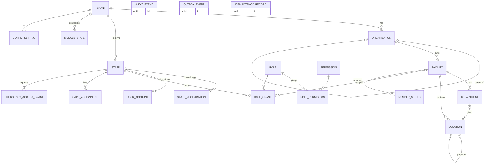

# M01 — Platform, organisation & access (schema `platform`)

The facility hierarchy everything hangs off, staff identity, authorization (role + facility + care relationship), module switches, numbering, and the shared audit/outbox/idempotency tables. Beds, wards, rooms, theatres, stores and counters are all rows in one `location` tree.

| Table | Key columns | Relationships / constraints |
|---|---|---|
| **tenant** (no RLS) | name, slug UQ, legal_name, pan, default_currency, default_timezone, status (`trial`,`active`,`suspended`,`closed`), plan_code | Has many organization |
| **organization** | name, org_type (`group`,`hospital`,`clinic`), parent_id | Tenant; self-hierarchy |
| **facility** | code UQ/tenant, name, facility_type (`hospital`,`clinic`,`diagnostic_centre`,`pharmacy`,`virtual`), **hfr_id** (ABDM HFR) UQ, nabh_accreditation_no, **gstin**, **state_code** (GST), address fields, pincode, timezone, is_virtual, status | Organization; GSTIN is per state, so it lives here |
| **department** | code, name, specialty_id (→ catalog), kind (`clinical`,`diagnostic`,`support`,`administrative`), parent_id, status | Facility |
| **location** | kind (`building`,`floor`,`ward`,`room`,`bed`,`theatre`,`store`,`counter`,`lab`,`imaging_room`,`consult_room`), code, name, parent_location_id, ward_type (`general`,`icu`,`nicu`,`picu`,`hdu`,`maternity`,`isolation`,`daycare`,`emergency`,`burns`,`dialysis`; ward rows only), gender_restriction, isolation_capable, bed_category_id (→ catalog; bed rows only), status | Facility; optional department; self-tree; CHECK bed rows have a ward ancestor + bed_category |
| **staff** | employee_no UQ/tenant, title, given_name, family_name, display_name, sex, birth_date, phone, email, staff_type (`doctor`,`nurse`,`technician`,`pharmacist`,`admin`,`support`,`other`), **hpr_id** (ABDM HPR), employment_type (`full_time`,`part_time`,`visiting`,`contract`), active_from, active_to, status | Tenant; 0..1 user_account. Same doctor in two tenants = two rows linked by hpr_id |
| **staff_registration** | council (`NMC`, state medical/nursing/pharmacy council), registration_no, valid_until, verified_at, document_id | Staff. Expired registration blocks clinical signing |
| **user_account** | identity_issuer, identity_subject, email (citext), phone, mfa_enrolled, status (`invited`,`active`,`locked`,`disabled`), last_login_at, failed_login_count; **staff_id** or **patient_id** (CHECK exactly one) | UQ (issuer, subject); portal users point at a patient |
| **permission** (global) | code UQ (e.g. `appointments.reschedule`, `results.release`, `mlc.read`, `invoice.discount.approve`), module_code, is_sensitive | — |
| **role** | tenant_id NULL = system role; code, name, is_clinical, is_system, cloned_from_id, settings jsonb (e.g. `max_discount_percent`) | Tenants clone system roles to customise |
| **role_permission** | role_id, permission_id | PK both |
| **role_grant** | staff_id, role_id, facility_id (NULL = all), valid_from, valid_to, granted_by, revoked_at | Scoped role assignment |
| **care_assignment** | staff_id, patient_id or encounter_id (CHECK one), reason (`attending`,`consulting`,`nursing`,`cover`), valid_from, valid_to | Clinical access needs a care relationship, not just a role |
| **emergency_access_grant** | staff_id, patient_id, reason, granted_at, expires_at, reviewed_by, reviewed_at, review_outcome | Break-glass; every use audited, reviewed next day |
| **module_state** | module_code, state (`not_provisioned`,`configured`,`validated`,`active`,`suspended`,`retired`), config_version, changed_by | UQ (tenant, module) — lets tenants switch off e.g. insurance |
| **config_setting** | key, value jsonb, version, effective_from, facility_id (nullable) | Versioned config |
| **number_series** | facility_id (nullable), series_kind (`mrn`,`encounter`,`ip_no`,`invoice`,`bill_of_supply`,`credit_note`,`receipt`,`mlc`,`order`,`dispense`,`token`,`accession`), period_key (e.g. FY `2026-27`, or date for tokens), prefix, next_value | UQ (tenant, facility, kind, period_key); allocated with `UPDATE … RETURNING` (no gaps from races; GST needs consecutive invoice numbers per FY) |
| **idempotency_record** | scope, key, request_hash, result_ref, status, expires_at | UQ (tenant, scope, key) |
| **audit_event** (append-only, monthly partitions) | occurred_at, actor_staff_id / actor_user_id, action (`create`,`update`,`status_change`,`view`,`export`,`print`,`login`,`break_glass`), subject_type, subject_id, patient_id, reason, from_version, to_version, diff jsonb, correlation_id, ip, user_agent | No UPDATE/DELETE grant; viewing a chart is audited too (DPDP accountability) |
| **outbox_event** (append-only) | event_type, aggregate_type, aggregate_id, aggregate_version, payload jsonb, occurred_at, claimed_until, processed_at, attempts, last_error | Workers claim with `FOR UPDATE SKIP LOCKED` |

**Access rule for every command:** active account → tenant membership → module active → capability granted for that facility → for clinical data, an active care_assignment / encounter_participant / emergency_access_grant.
