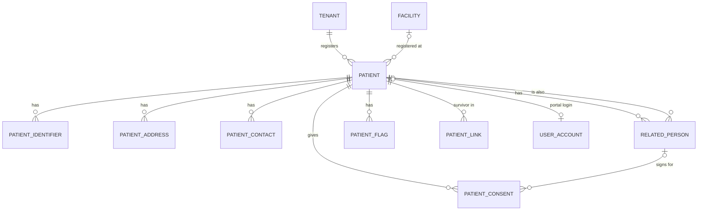

# M02 — Patient registry (schema `patient`)

The single longitudinal identity. Patients are created only by registration commands (never by phone-number matching); merges link, never delete.

| Table | Key columns | Relationships / constraints |
|---|---|---|
| **patient** | **mrn** (one per tenant, from number_series), registered_facility_id, title, given_name, middle_name, family_name, birth_date, birth_date_estimated, sex (`male`,`female`,`other`,`unknown`), preferred_language, blood_group, marital_status, occupation, **is_temporary** (unknown emergency patient, e.g. "Unknown Male 3"), verification_status (`unverified`,`verified`), registration_source (`front_desk`,`portal`,`whatsapp`,`voice`,`abha_scan`,`emergency`), **nka_confirmed_at** (no known allergies — distinguishes "none" from "not asked"), deceased_at, status (`active`,`merged`,`inactive`) | UQ (tenant, mrn); trigram index on names; btree on birth_date |
| **patient_identifier** | system (`abha_number`,`abha_address`,`pan`,`passport`,`voter_id`,`driving_licence`,`insurer_member_no`,`scheme_id` e.g. PM-JAY, `other`), value, verified_at, verified_via (`abdm_otp`,`abdm_face`,`document`), is_primary | UQ (tenant, system, value) |
| **patient_address** | kind (`home`,`work`,`temporary`), line1, line2, city, district, state_code, pincode, is_primary, valid_to | Patient |
| **patient_contact** | kind (`phone`,`email`), value, is_primary, verified_at, valid_to | Patient (messaging consent lives in M13) |
| **related_person** | name, relationship, phone, is_guardian, is_emergency_contact, is_legal_representative, representative_scope, related_patient_id, valid_to | Patient; guardian required for minors' consents |
| **patient_consent** | consent_type (`treatment`,`admission`,`procedure`,`anaesthesia`,`blood_transfusion`,`high_risk`,`teleconsult`,`data_sharing_abdm`,`research`,`lama_dama`), status (`signed`,`refused`,`withdrawn`,`expired`), signed_by (`patient`,`guardian`,`representative`), related_person_id, witness_staff_id, signed_at, expires_at, withdrawn_at, encounter_id, procedure_request_id, document_id, language | Patient; scanned form in M14. Clinical consents only — messaging opt-in is M13, ABDM consent artefacts are M17 |
| **patient_flag** | flag_type (`isolation`,`fall_risk`,`allergy_alert`,`safeguarding`,`vip`,`confidential`,`mlc`,`do_not_resuscitate`), active_from, active_to, set_by, reason | `confidential` restricts chart visibility to care team |
| **patient_link** | survivor_patient_id, other_patient_id, link_type (`possible_duplicate`,`merged`,`unmerged`), decided_by, second_reviewer_id, reason, decided_at | Merge needs two people; references to a merged patient resolve to its survivor; reversible |
