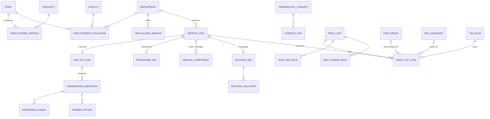

# M03 — Directory, catalogue, terminology & pricing (schema `catalog`)

What the hospital offers and what it costs. `service_item` is the single orderable **and** billable catalogue; inventory items (M10) are priced through the same price lists. Prices live in versioned price lists so cash, corporate, insurer and government-scheme rates can differ.

## Directory
| Table | Key columns | Relationships / constraints |
|---|---|---|
| **specialty** (global) | code, name, parent_id | Seeded |
| **practitioner_profile** | specialty_id, qualifications text[], bio, experience_years, languages text[], photo_document_id, accepts_virtual, public_slug UQ, published | 1:1 staff |
| **practitioner_affiliation** | staff_id, facility_id, department_id, role_title, valid_from, valid_to | Exclusion: no overlapping duplicate affiliation |
| **healthcare_service** | code, name, service_mode (`in_person`,`virtual`,`both`), default_duration_min, consultation_service_item_id, is_public | Department (what can be booked) |

## Terminology (global, read-only to tenants)
| Table | Key columns | Notes |
|---|---|---|
| **terminology_concept** | system (`snomed_ct`,`icd10_who`,`loinc`,`ucum`,`dicom_modality`), code, display, version, is_active, parent_codes text[] | UQ (system, code, version). SNOMED CT India edition (NRCeS), **WHO** ICD-10 (not ICD-10-CM) |
| **concept_map** | source_concept_id, target_concept_id, map_priority, map_rule | SNOMED → ICD-10 for claims |

## Service catalogue
| Table | Key columns | Relationships / constraints |
|---|---|---|
| **service_item** | code UQ/tenant, name, short_name, category (`consultation`,`lab_test`,`lab_panel`,`imaging`,`procedure`,`package`,`bed_day`,`nursing`,`diet`,`physiotherapy`,`referral`,`equipment`,`misc`), modality (imaging), concept_id, performing_department_id, is_orderable, is_billable, requires_consent, prep_instructions, **sac_code**, status | Single catalogue for orders + billing |
| **service_component** | parent_item_id, child_item_id, quantity, sequence | Panels (Lipid profile → tests) and package bundles; CHECK no self-reference |
| **lab_test_def** | service_item_id PK, section (`biochemistry`,`haematology`,`clinical_pathology`,`microbiology`,`serology`,`histopathology`,`cytology`,`molecular`,`immunology`), specimen_type, container_type (`edta`,`plain`,`sst`,`fluoride`,`citrate`,`heparin`,`sterile`), min_volume_ml, tat_minutes, method | 1:1 service_item |
| **observation_definition** | lab_test_item_id, code, name, loinc_concept_id, value_type (`numeric`,`text`,`coded`,`titre`,`culture`), unit (UCUM), decimal_places, sequence, is_reportable | Components of a lab test; also vital-sign definitions (lab_test_item_id NULL) |
| **reference_range** | observation_definition_id, sex, age_min_days, age_max_days, low, high, critical_low, critical_high, text_range, valid_from, valid_to | Age in days (neonates) |
| **answer_option** | observation_definition_id, code, display, is_abnormal | Coded results |
| **procedure_def** | service_item_id PK, snomed_concept_id, specialty_id, **surgery_grade** (`minor`,`intermediate`,`major`,`supra_major`), default_duration_min, needs_theatre, needs_anaesthesia | 1:1 service_item |
| **package_def** | service_item_id PK, included_los_days, max_bed_category_rank, procedure_def_id, scheme_package_code (PM-JAY HBP code etc.), valid_from, valid_to | Fixed-price bundle |
| **package_inclusion** | package_def_id, kind (`service_item`,`service_category`,`item`,`item_group`,`bed_days`), target ids (CHECK one per kind), qty_limit, amount_limit_minor | Usage beyond limits bills normally |
| **bed_category** | code, name, rank, is_icu, status | Billing class for beds (General, Semi-Private, Private, ICU…) |

## Pricing
| Table | Key columns | Relationships / constraints |
|---|---|---|
| **price_list** | name, kind (`cash`,`corporate`,`insurer_contract`,`government_scheme`,`staff`), payer_id (M12, nullable), currency, valid_from, valid_to, version, status (`draft`,`active`,`retired`), is_default | Partial UQ one default per tenant; **published versions immutable** |
| **price_list_item** | price_list_id, service_item_id **or** item_group_id/item_id (CHECK one), bed_category_id, staff_id (doctor-specific fee), encounter_class, **unit_price_minor** (services) or **item_pricing_method** (`mrp_less_discount`,`cost_plus_markup`) + percent (items), **charge_trigger** (`on_order`,`on_performance`,`daily`,`on_dispense`), tax_rule_id, valid_from, valid_to | Exclusion constraint on overlapping validity per (list, item, bed_category, staff, class) using COALESCE sentinels for NULLs; most specific match wins |
| **team_fee_rule** | price_list_id, role (`assistant_surgeon`,`anaesthetist`,…), percent_of_surgeon_fee_bp | Basis points (1% = 100) |
| **bed_charge_rule** | price_list_id (nullable = default), facility_id, method (`midnight_census`,`per_24h_from_admit`,`calendar_day_any_part`), grace_minutes, half_day_after_minutes, retained_bed_percent_bp, valid_from, valid_to | Configurable bed-day counting |
| **tax_rule** | tax_code, hsn_sac_code, service_category, item_type, encounter_class, min_unit_price_minor (threshold rules), excluded_ward_types text[], gst_rate_bp, cess_rate_bp, itc_allowed, priority, valid_from, valid_to, legal_reference | **GST as data**, configured with the tenant's CA. Seed examples: clinical-establishment healthcare services exempt; non-ICU room rent above the notified threshold taxable; OPD pharmacy by HSN; inpatient drugs as part of treatment exempt (composite supply). Verify current notifications before go-live |
