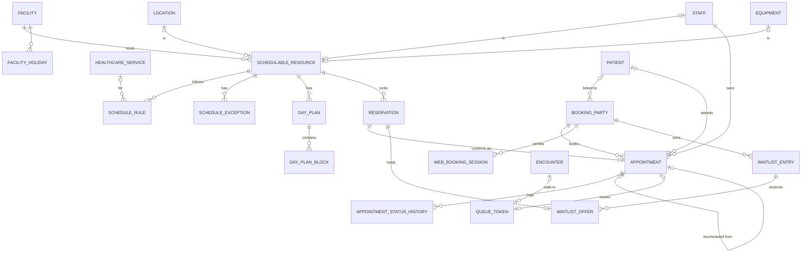

# M04 — Scheduling & booking (schema `booking`)

The **only** place capacity is allocated, for every channel (web, portal, WhatsApp, voice, front desk, walk-in). A doctor, consult room, theatre or scanner is a `schedulable_resource`; a `reservation` is the lock on its time. An appointment can exist before the patient's identity is verified, through `booking_party`.

| Table | Key columns | Relationships / constraints |
|---|---|---|
| **schedulable_resource** | kind (`practitioner`,`room`,`theatre`,`equipment`), staff_id / location_id / equipment_id (CHECK one, matching kind), name, is_active | Facility |
| **schedule_rule** | weekday 1–7, start_local, end_local (CHECK end > start), slot_minutes (NULL = token-only session), max_slot_bookings, max_walk_in_tokens, visit_mode (`in_person`,`virtual`), healthcare_service_id, effective_from, effective_to | Resource. **Slots are computed** (rule − exceptions − reservations), never materialised |
| **schedule_exception** | on_date, kind (`closed`,`extra_hours`,`block`), start_local, end_local, reason | Resource |
| **facility_holiday** | holiday_on, name | Facility |
| **day_plan** / **day_plan_block** | plan_on, revision, replaces_weekly, saved_by / block: facility_id, start_local, end_local, visit_mode | A one-day override of the weekly rule (doctor works at two branches that day) |
| **reservation** | resource_id, period tstzrange, status (`held`,`booked`,`released`,`expired`), owner_type (`appointment`,`theatre_booking`,`imaging_study`,`waitlist_offer`), owner_id, hold_expires_at, idempotency_key | **`EXCLUDE USING gist (tenant_id WITH =, resource_id WITH =, period WITH &&) WHERE (status IN ('held','booked'))`** + row lock on resource. Holds expired by a sweeper job, never by a `now()` predicate (not allowed in index predicates) |
| **booking_party** | name, phone, email, verified_channel (`otp_sms`,`whatsapp`,`portal`,`staff`), verified_at, patient_id (set once identity is linked) | Who booked; may be a relative |
| **web_booking_session** | token_hash, verified_via, expires_at | Booking_party |
| **appointment** | confirmation_code UQ, reservation_id UQ (NULL for walk-in), booking_party_id, patient_id (nullable until linked), practitioner_staff_id, facility_id, healthcare_service_id, session_on, starts_at, ends_at, **booking_kind** (`slot`,`walk_in`), visit_type (`new`,`follow_up`,`review`,`procedure`), visit_mode, origin_channel (`web`,`portal`,`whatsapp`,`voice`,`front_desk`,`walk_in`,`referral`), priority (`normal`,`senior_citizen`,`emergency`,`vip`), **fee_snapshot_minor**, currency, reason_text, status (`confirmed`,`checked_in`,`completed`,`cancelled`,`no_show`), cancel_reason, rescheduled_from_id | CHECK (`booking_kind='slot'`) = (reservation_id IS NOT NULL); check-in requires patient_id |
| **appointment_status_history** | from_status, to_status, actor, reason, occurred_at | Appointment |
| **queue_token** | department_id, practitioner_staff_id, session_on, token_no (from number_series per resource/day), issued_at, called_at, service_started_at, status (`waiting`,`called`,`in_service`,`done`,`skipped`) | Appointment **or** encounter; UQ (resource, session_on, token_no). Gives wait-time analytics |
| **waitlist_entry** | practitioner_staff_id or healthcare_service_id, preferred_dates daterange[], status (`waiting`,`offered`,`accepted`,`withdrawn`,`expired`) | Booking_party |
| **waitlist_offer** | offered_at, expires_at, outcome | Waitlist_entry; holds one reservation |
