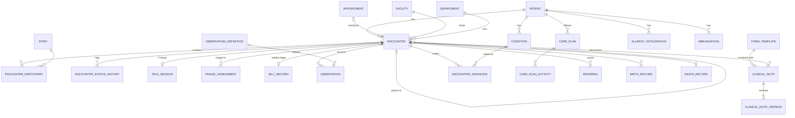

# M05 — Encounters, emergency & clinical documentation (schema `clinical`)

The chart. The **encounter** is the clinical context for everything done to a patient (OPD, IPD, emergency, day care, teleconsult); it is separate from the appointment (scheduling) and the admission (bed management). Notes, observations and reports are versioned; signed records can only be amended.

## Encounter
| Table | Key columns | Relationships / constraints |
|---|---|---|
| **encounter** | encounter_no (number_series), encounter_class (`outpatient`,`emergency`,`inpatient`,`day_care`,`virtual`), status (`planned`,`arrived`,`in_progress`,`on_leave`,`finished`,`cancelled`,`entered_in_error`), started_at, ended_at, chief_complaint, referral_source (`self`,`internal`,`external_doctor`,`camp`,`other`), referred_by_name, **disposition** (`discharged_home`,`admitted`,`referred_out`,`lama`,`absconded`,`died`,`follow_up`), follow_up_advised_on, follow_up_of_id | Patient; facility; department; attending staff; optional appointment (UQ); optional parent_encounter_id (ER → IPD) |
| **encounter_participant** | role (`attending`,`consulting`,`resident`,`nurse`,`referrer`,`anaesthetist`), period tstzrange | Encounter ↔ staff; grants clinical access |
| **encounter_status_history** | from_status, to_status, actor, occurred_at | Encounter |
| **tele_session** | provider, room_ref, identity_verified_by, consent_id, started_at, ended_at, recording_document_id | 1:1 virtual encounter (Telemedicine Practice Guidelines 2020: identity + consent; drug-list limits enforced via `drug_product.tele_list`) |

## Emergency
| Table | Key columns | Relationships / constraints |
|---|---|---|
| **triage_assessment** | triage_scale (`india_colour`,`esi`,`mts`), category (`red`,`yellow`,`green`,`black` or scale level), arrival_mode (`walk_in`,`ambulance_108`,`private_ambulance`,`police`,`referred`), chief_complaint, assessed_at, reassess_due_at | Encounter; assessed_by staff; repeatable (re-triage) |
| **mlc_record** | mlc_no (number_series per facility), mlc_type (`road_traffic`,`assault`,`burns`,`poisoning`,`fall`,`sexual_assault`,`animal_bite`,`industrial`,`suspected_suicide`,`brought_dead`,`other`), incident_at, incident_place, brought_by_name, brought_by_relation, brought_by_phone, police_station, police_intimated_at, intimation_mode, intimation_ref, officer_name, officer_badge_no, injury_details jsonb, wound_certificate_document_id, evidence_handover jsonb (chain of custody), is_pocso | 1:1 encounter; capability `mlc.read`. **All police fields nullable — treatment never waits on them** |

## Documentation
| Table | Key columns | Relationships / constraints |
|---|---|---|
| **observation** | observation_definition_id / code (LOINC), category (`vital_sign`,`score`,`measurement`,`nursing_assessment`), value_num, value_text, value_option_id, unit, effective_at (when measured), recorded_at, group_id (one vitals capture), is_abnormal, status (`final`,`amended`,`entered_in_error`), supersedes_id | Patient; encounter; recorded_by. Narrow form: GCS, pain score, GRBS, NEWS2 need no migration |
| **form_template** | tenant_id NULL = system, code, version, name, specialty_id, note_type, schema jsonb (JSON Schema), ui_schema jsonb, status (`draft`,`published`,`retired`) | UQ (tenant, code, version); published versions immutable |
| **clinical_note** | note_type (`consultation`,`history`,`examination`,`progress`,`nursing`,`operative`,`procedure`,`consult`,`discharge_summary`,`death_summary`), status (`draft`,`signed`,`amended`,`entered_in_error`), signed_at, signed_by, current_version | Encounter; patient; author |
| **clinical_note_version** | version_no, form_template_id, data jsonb, narrative text, amendment_reason, created_at, created_by | UQ (note, version_no); **app role has no UPDATE grant** — amendments insert a version |
| **condition** | concept_id (SNOMED), icd10_concept_id, free_text, clinical_status (`active`,`recurrence`,`remission`,`resolved`), verification_status (`provisional`,`differential`,`confirmed`,`refuted`), onset_at, abatement_at, is_chronic | Patient; recorded_by; the longitudinal problem list. CHECK at least one of concept/icd10/free_text |
| **encounter_diagnosis** | role (`admitting`,`provisional`,`primary`,`secondary`,`discharge`), rank | Joins encounter and condition; partial UQ one `primary` per encounter |
| **allergy_intolerance** | category (`drug`,`food`,`environment`,`other`), substance_concept_id, drug_item_id (M10), substance_text, reaction, severity (`mild`,`moderate`,`severe`), criticality, status (`active`,`inactive`,`refuted`) | Patient; drives prescribing checks |
| **immunization** | vaccine_concept_id, item_batch_id (M10), dose_number, administered_at, route, site, administered_by, status | Patient; encounter. Needed for ABDM `ImmunizationRecord` and newborn/paediatric care |
| **care_plan** / **care_plan_activity** | title, status, period / activity: kind, description, frequency, status | Patient; encounter; activities become `work_task` rows (M15) |
| **referral** | direction (`internal`,`outbound`,`inbound`), reason, urgency, status (`sent`,`accepted`,`rejected`,`completed`), to_department_id, to_staff_id, external_org, external_doctor | From encounter |

## Birth & death (statutory)
| Table | Key columns | Relationships / constraints |
|---|---|---|
| **birth_record** | mother_patient_id, baby_patient_id (newborn registered as own patient), born_at, sex, birth_weight_g, gestation_weeks, delivery_method (`normal_vaginal`,`assisted_vaginal`,`lscs`,`other`), birth_order, apgar_1, apgar_5, is_live_birth, attended_by, civil_registration_ref, reported_at | Mother's encounter. RBD Act registration |
| **death_record** | died_at, pronounced_by, cause_chain jsonb (immediate → antecedent), contributing_conditions jsonb, manner (`natural`,`accident`,`suicide`,`homicide`,`pending_investigation`,`undetermined`), mccd_form (`form_4`,`form_4a`), mccd_issued_at, certified_by, is_mlc, post_mortem_required, body_released_to, body_released_at | 1:1 encounter; trigger sets `patient.deceased_at` |
