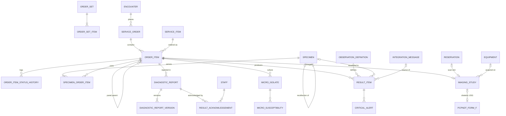

# M06 — Orders, laboratory & imaging (schema `diagnostics`)

Separates the order, the specimen, the result, the released report and the clinician's acknowledgement. One specimen can serve several tests (link table). Lab analysers and PACS connect through M16.

| Table | Key columns | Relationships / constraints |
|---|---|---|
| **order_set** / **order_set_item** | name, owner_staff_id (NULL = department set), department_id / service_item_id, default_priority, default_details jsonb | Doctor favourites for CPOE |
| **service_order** | requisition_no (number_series), priority (`routine`,`urgent`,`stat`), clinical_indication, ordered_at, status (`active`,`completed`,`cancelled`) | Encounter; patient; ordered_by |
| **order_item** | quantity, details jsonb (diet type, physio instructions…), scheduled_at, status (`ordered`,`scheduled`,`collected`,`in_progress`,`resulted`,`released`,`cancelled`), cancel_reason, panel_parent_item_id, target_staff_id (internal consult) | Service_order; one service_item; performing department |
| **order_item_status_history** | from_status, to_status, actor, occurred_at | Order_item |
| **specimen** | accession_no / barcode (UQ per tenant), specimen_type, container_type, collected_at, collected_by, collection_site, received_at, received_by, status (`pending`,`collected`,`received`,`rejected`,`consumed`,`stored`,`disposed`), rejection_reason (`haemolysed`,`clotted`,`insufficient`,`mislabelled`,`wrong_container`,`delayed`,`other`), recollection_of_id | Patient |
| **specimen_order_item** | specimen_id, order_item_id | PK both (many-to-many) |
| **result_item** | value_num, value_text, value_option_id, **snapshot** unit / ref_low / ref_high / ref_text, abnormal_flag (`normal`,`low`,`high`,`critical_low`,`critical_high`,`abnormal`), is_critical, status (`preliminary`,`final`,`corrected`,`cancelled`), source (`manual`,`instrument`), entered_by, entered_at, verified_by, verified_at, supersedes_id | Order_item; observation_definition; optional specimen; optional integration_message. Partial UQ one current value per (order_item, definition) |
| **critical_alert** | notified_by, notified_to_staff_id, notified_to_name, notified_at, channel (`phone`,`in_person`,`app`), read_back_confirmed | Result_item (NABH/NABL documented communication) |
| **micro_isolate** / **micro_susceptibility** | organism_concept_id, colony_count, sequence / antibiotic_item_id, method (`disc`,`mic`), mic_value, zone_mm, interpretation (`S`,`I`,`R`) | Order_item → isolate → AST |
| **diagnostic_report** | report_type (`lab`,`imaging`,`pathology`), status (`registered`,`preliminary`,`final`,`amended`,`cancelled`), conclusion, released_at, released_by (authorised signatory — NABL), current_version | Order_item |
| **diagnostic_report_version** | version_no, body jsonb (findings / impression / results snapshot), form_template_id, amendment_reason, document_id (PDF), created_at | UQ (report, version_no); no UPDATE grant |
| **result_acknowledgement** | acknowledged_at, action_taken | Diagnostic_report ↔ staff; one per responsible clinician; unacknowledged critical results escalate via work_task |
| **imaging_study** | modality (DICOM: `CR`,`DX`,`CT`,`MR`,`US`,`MG`,`NM`,`PT`,`XA`,`RF`), accession_no (UQ per facility — DICOM worklist key), study_instance_uid UQ, status (`scheduled`,`arrived`,`in_progress`,`completed`,`reported`,`cancelled`), performed_at, contrast_item_id, dose_dlp_mgy_cm, pacs_url, is_obstetric | 1:1 order_item; performed_by; equipment (M15); scan slot = M04 reservation |
| **pcpndt_form_f** | form_data jsonb, patient_declaration_at, doctor_declaration_by, doctor_declaration_at, reporting_month, submitted_to_authority_at, retain_until | 1:1 imaging_study. **PC-PNDT Act**: Form F for every ultrasound on a pregnant woman; monthly report to the Appropriate Authority; records kept 2 years (deletion blocked). Obstetric USG can't be `completed` without it |
