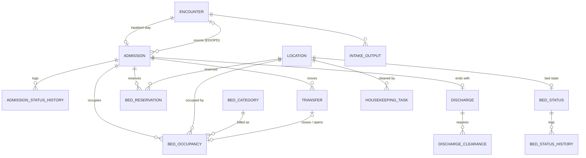

# M07 — Inpatient: admission, beds, transfer, discharge, housekeeping (schema `inpatient`)

Manages the bed as a resource. A bed is a `platform.location` row (kind `bed`); this module owns its status, reservations and occupancy. The discharge decision, the clearances, the departure and bed readiness each have their own record and timestamp — **a bed becomes available after cleaning and inspection, not at discharge**.

| Table | Key columns | Relationships / constraints |
|---|---|---|
| **admission** | ip_no (number_series), admission_type (`elective`,`emergency`,`transfer_in`,`day_care`,`maternity`), requested_at, decision_at, admitted_at, expected_discharge_at, requested_bed_category_id, admission_reason, status (`requested`,`reviewed`,`bed_pending`,`bed_reserved`,`admitted`,`discharge_planned`,`discharged`,`cancelled`) | 1:1 inpatient/day-care encounter; patient; admitting staff; optional source encounter. **`bed_pending`** = admitted decision but waiting in ED/holding for a bed (an admission can have zero occupancies for a while) |
| **admission_status_history** | from_status, to_status, actor, occurred_at | Admission |
| **bed_status** | status (`ready`,`reserved`,`occupied`,`vacated`,`dirty`,`cleaning`,`inspection`,`blocked`,`maintenance`), since, set_by | 1:1 bed location. Kept consistent with occupancy by commands that lock this row; nightly reconciliation flags drift (M16) |
| **bed_status_history** | from_status, to_status, actor, reason, occurred_at | Bed_status |
| **bed_reservation** | reserved_at, expires_at, status (`held`,`converted`,`released`,`expired`) | Bed location; admission or transfer. Only a `ready` bed can be reserved |
| **bed_occupancy** | period tstzrange, kind (`primary`,`retained`), reason (`admit`,`transfer`,`swap`), **billed_bed_category_id** | Admission; bed location. **`EXCLUDE (bed WITH =, period WITH &&)`** one occupant per bed; **`EXCLUDE (admission WITH =, period WITH &&) WHERE kind='primary'`** one primary bed per patient. `retained` = room kept while in ICU (billable) |
| **transfer** | requested_at, accepted_at, moved_at, received_at, status (`requested`,`accepted`,`moved`,`received`,`cancelled`), reason, from_bed_id, to_bed_id, from_department_id, to_department_id | Admission; requested_by, accepted_by, received_by staff |
| **discharge** | decision_at, discharge_type (`routine`,`lama`,`dama`,`absconded`,`transfer_out`,`referred`,`death`), expected_departure_at, departure_at, status (`planned`,`cleared`,`departed`,`cancelled`), summary_note_id (M05), discharge_prescription_id (M09), lama_consent_id (M02) | 1:1 admission; decided_by |
| **discharge_clearance** | kind (`clinical`,`pharmacy`,`nursing`,`finance`,`insurance`), status (`pending`,`cleared`,`waived`), cleared_at, cleared_by, waiver_reason | Discharge; departure requires all cleared/waived |
| **housekeeping_task** | trigger (`vacated`,`isolation`,`spill`,`routine`), requested_at, started_at, completed_at, inspected_at, inspection_result (`pass`,`fail`), isolation_protocol, assigned_to, inspected_by | Bed location; pass → bed_status `ready` |
| **intake_output** | recorded_at, direction (`intake`,`output`), route (`oral`,`iv`,`ng`,`urine`,`drain`,`vomit`,`stool`), volume_ml, recorded_by, status (`final`,`entered_in_error`) | Encounter; fluid balance charting |
