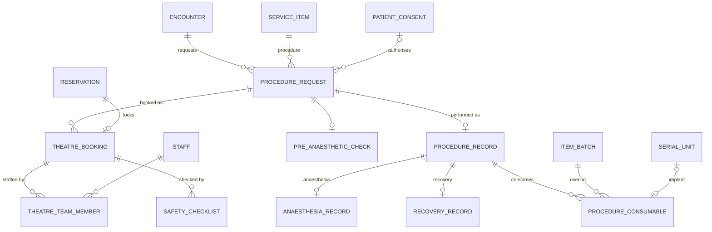

# M08 — Theatre & procedures (schema `theatre`)

Keeps the request, the booking, the safety checks and the performed record apart, so planned, performed, cancelled and deferred procedures stay distinct. Theatre time is an M04 reservation on the theatre resource, so emergency and elective cases compete through the same lock.

| Table | Key columns | Relationships / constraints |
|---|---|---|
| **procedure_request** | urgency (`elective`,`urgent`,`emergency`), proposed_on, laterality (`left`,`right`,`bilateral`,`not_applicable`), pre_op_diagnosis, status (`requested`,`scheduled`,`ready`,`in_theatre`,`completed`,`cancelled`,`deferred`), cancel_reason | Encounter; patient; procedure service_item; requested_by; consent (M02) required before `ready` |
| **theatre_booking** | scheduled tstzrange, list_order, status (`booked`,`confirmed`,`started`,`finished`,`cancelled`) | Procedure_request; theatre location; one reservation (M04) — no double-booked theatre |
| **theatre_team_member** | role (`primary_surgeon`,`assistant_surgeon`,`anaesthetist`,`scrub_nurse`,`circulating_nurse`,`perfusionist`,`technician`) | Booking ↔ staff. Surgeon double-booking across theatres checked by command (staff also a schedulable resource) |
| **pre_anaesthetic_check** | done_at, done_by, asa_class 1–6, airway_assessment jsonb, fitness (`fit`,`fit_with_risk`,`unfit`,`deferred`), instructions | 1:1 procedure_request |
| **safety_checklist** | phase (`sign_in`,`time_out`,`sign_out`), items jsonb (WHO checklist), completed_at, completed_by | Theatre_booking; UQ (booking, phase). Incision time can't be recorded before `time_out` exists |
| **procedure_record** | in_room_at, anaesthesia_start_at, incision_at, closure_at, out_of_room_at (CHECKs keep order), post_op_diagnosis, outcome, status (`completed`,`abandoned`) | 1:1 procedure_request; primary surgeon; operative note (M05) |
| **anaesthesia_record** | technique (`general`,`spinal`,`epidural`,`regional_block`,`local`,`sedation`), asa_class, started_at, ended_at, intraop_data jsonb | 1:1 procedure_record; anaesthetist; note (M05) |
| **recovery_record** | arrived_at, aldrete_scores jsonb, discharged_at, handed_to_staff_id, handed_to_location_id | 1:1 procedure_record |
| **procedure_consumable** | quantity, serial_unit_id (implants), wastage_qty | Procedure_record; item + item_batch (M10). Creates a stock movement and a charge; implant serial gives recall traceability |
