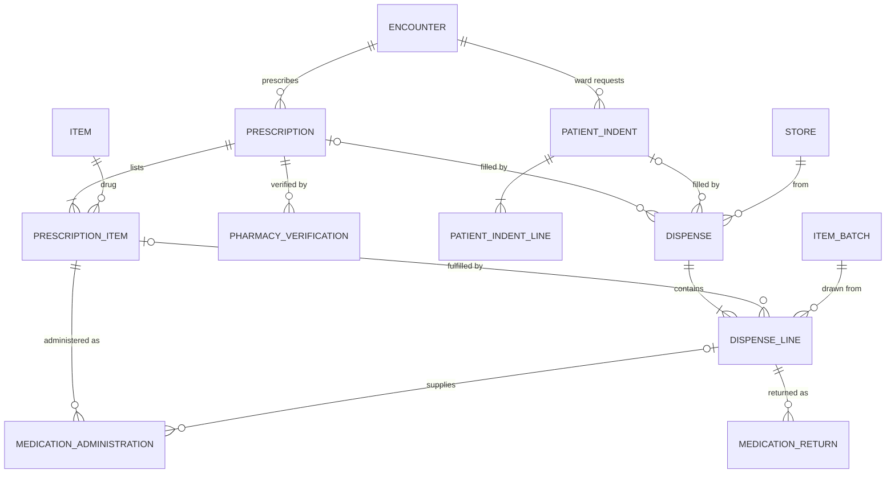

# M09 — Pharmacy & medication administration (schema `pharmacy`)

Prescribing, pharmacist verification, dispensing and administration are four separate lifecycles. Prescriptions have line items; every dispense line and every administered dose points at the line it fulfils, so outstanding quantity is always computable. Dispensing is to **registered patients only**.

| Table | Key columns | Relationships / constraints |
|---|---|---|
| **prescription** | setting (`outpatient`,`inpatient`,`discharge`,`virtual`), signed_at, valid_until, advice, scan_document_id (Schedule X needs the prescription retained), status (`draft`,`signed`,`verified`,`partially_dispensed`,`completed`,`on_hold`,`cancelled`) | Encounter; patient; prescriber (valid registration required to sign) |
| **prescription_item** | line_no, drug item_id, **generic_name / brand_name snapshot**, dose, dose_unit, route, frequency_code (`OD`,`BD`,`TDS`,`QID`,`HS`,`SOS`,`STAT`,`Q4H`,`Q6H`,`Q8H`,`WEEKLY`,`CUSTOM`), frequency_text, duration_value, duration_unit, quantity_prescribed, is_prn, food_relation (`before_food`,`after_food`,`with_food`,`empty_stomach`,`any`), instructions, substitution_allowed, start_at, stop_at, stopped_by, stop_reason, status (`active`,`held`,`stopped`,`completed`,`cancelled`) | Prescription; item (M10). Allergy and duplicate-therapy checks run on sign |
| **pharmacy_verification** | outcome (`approved`,`rejected`,`query`), notes, verified_at | Prescription; pharmacist |
| **patient_indent** / **patient_indent_line** | requesting ward store, pharmacy store, requested_at, status (`submitted`,`partially_dispensed`,`dispensed`,`cancelled`) / prescription_item_id (NULL for consumables), item_id, qty_requested | Encounter; nurse request for an inpatient |
| **dispense** | dispense_no, dispense_type (`opd_prescription`,`ipd_indent`,`discharge`,`ot_issue`,`emergency`), dispensed_at, handed_over_to, status (`prepared`,`handed_over`,`partially_returned`,`cancelled`) | Prescription and/or patient_indent; patient; encounter (NOT NULL); store; dispensed_by |
| **dispense_line** | quantity (base units), **mrp_snapshot_minor**, **unit_price_minor**, discount_minor, price_list_item_id, substitution_approved_by, substituted_from_item_id | Dispense; prescription_item; item + item_batch (+ serial_unit). CHECK `unit_price_minor ≤ mrp_snapshot_minor` (selling above MRP is illegal). Dispense command locks the prescription_item and checks Σ dispensed ≤ prescribed |
| **medication_administration** | scheduled_at, administered_at, dose_given, dose_unit, route, site, status (`given`,`not_given`,`held`,`refused`,`self_administered`), reason, prn_reason | Prescription_item; patient; encounter; administered_by; **witness_staff_id** (required for controlled / high-alert drugs); optional dispense_line. Partial UQ (prescription_item_id, scheduled_at) WHERE status='given' AND NOT is_prn; PRN doses checked by minimum-interval rule in the command |
| **medication_return** | quantity, reason, is_restockable, received_at | Dispense_line; received_by. Creates a return stock movement and a charge reversal |

**Statutory registers are views, not tables** (they can't drift from what was dispensed): Schedule H1 register (Drugs Rules — patient, prescriber, drug, qty; retained 3 years), Schedule X and NDPS registers, implant traceability (serial → patient). Deletion is impossible anyway (no DELETE on these tables).
