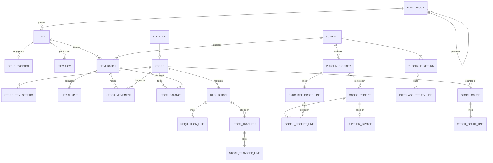

# M10 — Inventory & procurement (schema `inventory`)

Stock derives from an **append-only movement ledger**. `stock_balance` is a running total updated in the same transaction as each movement, with a check that on-hand never goes negative. Drugs are inventory items with a drug profile, so pharmacy and stores share one catalogue. All quantities are in base units; batches are picked FEFO (first expiry first out).

## Items
| Table | Key columns | Relationships / constraints |
|---|---|---|
| **item_group** | code, name, parent_id | Pricing & reporting group (Tablets, Implants, Surgical consumables…) |
| **item** | code UQ/tenant, name, item_type (`drug`,`consumable`,`implant`,`reagent`,`vaccine`,`general`), base_uom, hsn_code, is_batch_tracked, is_expiry_tracked, is_serial_tracked, is_cold_chain, is_billable, reorder_level, status | Priced through `catalog.price_list_item` |
| **drug_product** | generic_name (required), brand_name, strength, dosage_form, default_route, manufacturer, **regulatory_schedule** (`none`,`G`,`H`,`H1`,`X`), is_ndps, is_high_alert, **tele_list** (`list_o`,`list_a`,`list_b`,`prohibited`), snomed_concept_id, is_nlem (DPCO price-controlled) | 1:1 item |
| **item_uom** | uom (`strip`,`box`,`vial`…), factor_to_base, is_purchase_uom, is_issue_uom | Item. Strip of 10 → factor 10 |

## Stores & stock
| Table | Key columns | Relationships / constraints |
|---|---|---|
| **store** | store_type (`central`,`pharmacy`,`ward`,`theatre`,`icu`,`lab`,`emergency`), name, parent_store_id (replenishment source), can_dispense_to_patient, drug_licence_no | 1:1 store location (M01); facility |
| **store_item_setting** | min_level, max_level, reorder_qty, bin_location | Store ↔ item |
| **supplier** | name, gstin, state_code, drug_licence_no (wholesale), pan, contact, payment_terms_days, status | — |
| **item_batch** | batch_no, manufactured_on, expiry_date, **mrp_minor** (per base unit), **unit_cost_minor**, received_at, status (`available`,`quarantined`,`recalled`,`expired`) | Item; supplier; UQ (tenant, item, batch_no). Issue commands reject non-`available` or expired batches |
| **serial_unit** | serial_no, status (`in_stock`,`in_transit`,`issued`,`implanted`,`returned_to_vendor`,`written_off`), current_store_id | Batch; UQ (item, serial_no) |
| **stock_movement** (append-only, monthly partitions) | movement_type (`opening`,`receipt`,`transfer_out`,`transfer_in`,`issue_to_patient`,`patient_return`,`consumption`,`adjustment`,`expiry_disposal`,`damage`,`vendor_return`), quantity (signed, base units), unit_cost_minor, occurred_at, source_type, source_id + typed FKs (`dispense_line_id`, `procedure_consumable_id`, `goods_receipt_line_id`, `transfer_line_id`, `count_line_id`, `return_line_id`; CHECK exactly one) | Item; batch; serial; store; actor |
| **stock_balance** | on_hand CHECK ≥ 0, reserved CHECK ≥ 0 | UQ (store, item_batch); updated in the movement's transaction under row lock; nightly reconcile vs Σ movements |

## Internal supply
| Table | Key columns | Relationships / constraints |
|---|---|---|
| **requisition** / **requisition_line** | from_store, to_store, status (`draft`,`submitted`,`approved`,`partially_issued`,`issued`,`cancelled`), requested_by, approved_by / item, qty_requested, qty_approved, qty_issued | Store-to-store indent |
| **stock_transfer** / **stock_transfer_line** | from_store, to_store, status (`in_transit`,`received`,`partially_received`), dispatched_at, received_at / batch, serial, qty_sent, qty_received, discrepancy_reason | Requisition (optional) |
| **stock_count** / **stock_count_line** | counted_at, status (`open`,`submitted`,`approved`), approved_by / batch, system_qty, counted_qty | Store; approval writes adjustment movements |

## Procurement
| Table | Key columns | Relationships / constraints |
|---|---|---|
| **purchase_order** / **purchase_order_line** | po_no, status (`draft`,`approved`,`sent`,`partially_received`,`received`,`closed`,`cancelled`), total_minor, approved_by / item, uom, quantity, unit_price_minor, gst_rate_bp, free_qty | Supplier; receiving store |
| **goods_receipt** / **goods_receipt_line** | received_at, supplier_invoice_ref, received_by / batch_no, expiry_date, mrp_minor, unit_cost_minor, qty_received, qty_free, qty_rejected, reject_reason, serial_nos text[] | Purchase_order (optional — direct receipts allowed); line creates/tops up item_batch |
| **supplier_invoice** | invoice_no, invoice_date, taxable_minor, cgst_minor, sgst_minor, igst_minor, total_minor, due_on, match_status (`unmatched`,`matched`,`variance`), status (`recorded`,`approved`,`paid`) | Supplier; goods_receipt(s). UQ (supplier, invoice_no) — no double entry. Three-way match PO ↔ GRN ↔ invoice |
| **purchase_return** / **purchase_return_line** | return_no, reason (`expired`,`damaged`,`recalled`,`excess`), debit_note_ref / batch, qty | Supplier; creates vendor-return movements |
