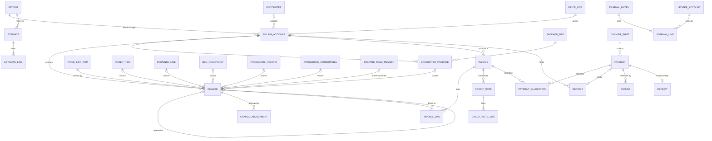

# M11 — Billing, cashier & ledger (schema `billing`)

Keeps estimate, charge, invoice, payment, allocation, receipt and refund separate. Charges point back to the source record that caused them, with a unique key that stops a retry from double-charging. Invoices list charges through invoice lines, so one charge can be split between patient and payer.

## Accounts, estimates, packages
| Table | Key columns | Relationships / constraints |
|---|---|---|
| **billing_account** | account_no, account_type (`self_pay`,`insurance`,`corporate`,`government_scheme`), status (`open`,`on_hold`,`closed`), credit_limit_minor | Patient; optional encounter/admission (one account per episode); price_list; coverage (M12) |
| **estimate** / **estimate_line** | total_minor, bed_category_id, expected_los_days, package_def_id, valid_until, status (`draft`,`given`,`superseded`,`expired`) / service_item or item, quantity, unit_price_minor | Patient; encounter or procedure_request |
| **encounter_package** | price_snapshot_minor, applied_at, applied_by, status (`active`,`removed`) | Billing_account ↔ package_def |
| **deposit_rule** | facility_id, bed_category_id, min_deposit_minor, alert_below_minor | Admission deposit and low-balance alerts |
| **deposit** | amount_minor, status (`held`,`applied`,`refunded`) | Billing_account; the payment that funded it |

## Charges
| Table | Key columns | Relationships / constraints |
|---|---|---|
| **charge** | **source_type** (`consultation`,`order_item`,`dispense_line`,`bed_day`,`procedure_record`,`procedure_consumable`,`professional_fee`,`package`,`manual`), **source_id** + typed nullable FKs, service_date, service_item_id or item_id, description (snapshot), quantity, **unit_price_minor**, **price_list_item_id + price_list version (snapshot)**, gross_minor, discount_minor, taxable_minor, gst_rate_bp, cgst_minor, sgst_minor, igst_minor, net_minor, tax_rule_id, encounter_package_id, is_package_inclusive, status (`posted`,`invoiced`,`reversed`), reversal_of_id, posted_by, posted_at | Billing_account; patient; encounter. **Partial UQ (source_type, source_id, service_date) WHERE status <> 'reversed'** — a retried event never double-charges. Corrections = reversal row, never UPDATE |
| **charge_adjustment** | kind (`discount`,`write_off`,`correction`), amount_minor or percent_bp, reason, requested_by, approved_by, status (`pending`,`approved`,`rejected`) | Charge; approval above the role's `max_discount_percent` |

## Invoices
| Table | Key columns | Relationships / constraints |
|---|---|---|
| **invoice** | invoice_no (number_series per facility GSTIN per FY, assigned at issue — drafts don't burn numbers), **document_type** (`tax_invoice`,`bill_of_supply`,`invoice_cum_bill_of_supply` — GST requires a bill of supply for exempt supplies), bill_kind (`opd`,`ipd_final`,`pharmacy`,`day_care`,`emergency`,`payer`), bill_to (`patient`,`payer`), payer_id, issued_at, due_on, totals (gross, discount, taxable, cgst, sgst, igst, round_off, net, paid) in minor units, status (`draft`,`issued`,`partially_paid`,`paid`,`void`,`credited`) | Billing_account; UQ (facility, invoice_no). Issued invoices immutable. Interim IPD bills are **statements** (queries), not invoices |
| **invoice_line** | amount_minor, share (`patient`,`payer`), copay_minor | Invoice ↔ charge; Σ shares of a charge = charge net |
| **credit_note** / **credit_note_line** | note_no (series), reason, amount_minor, tax reversal fields, approved_by / charge_id, quantity, amount_minor | Invoice |

## Money in and out
| Table | Key columns | Relationships / constraints |
|---|---|---|
| **cashier_shift** | opened_at, closed_at, opening_float_minor, expected_cash_minor, counted_cash_minor, variance_minor, status (`open`,`closed`,`verified`), verified_by | Staff; counter location |
| **payment** | payer_type (`patient`,`payer`,`corporate`), method (`cash`,`upi`,`card`,`net_banking`,`cheque`,`dd`,`wallet`,`remittance`), amount_minor, currency, reference_no (UPI ref / RRN / cheque no.), gateway_ref, idempotency_key, status (`pending`,`captured`,`failed`,`unknown`,`partially_refunded`,`refunded`,`bounced`), captured_at | Optional patient or payer; cashier_shift (required for cash). **Income Tax Act s.269ST**: command blocks cash that would take one person's day total or one episode's total to ≥ ₹2,00,000. `unknown` = gateway timeout; resolved by reconciliation (M16) |
| **payment_allocation** | amount_minor, allocated_at, reversed_at | Payment ↔ invoice; command locks both, Σ ≤ payment and ≤ invoice balance |
| **refund** | amount_minor, reason, method, gateway_ref, status (`requested`,`approved`,`paid`,`failed`), approved_by | Payment; credit_note (optional) |
| **receipt** | receipt_no (series), issued_at, document_id | 1:1 payment |

## Ledger (double-entry) and export
| Table | Key columns | Relationships / constraints |
|---|---|---|
| **ledger_account** | code, name, account_type (`asset`,`liability`,`income`,`expense`,`equity`), external_ledger_name (Tally/Zoho mapping) | Chart of accounts |
| **journal_entry** / **journal_line** | posted_at, source_type, source_id, narration / ledger_account_id, debit_minor, credit_minor, cost_centre | Deferred constraint trigger: Σ debit = Σ credit per entry. Posted for invoices, payments, refunds, supplier invoices, remittances |
| **accounting_export** | period daterange, target (`tally_xml`,`zoho_books`,`csv`), status (`generated`,`imported`,`failed`), document_id | Non-overlapping periods per facility+target (no double export) |

Bed-day charges are generated by a daily job walking `bed_occupancy` with `catalog.bed_charge_rule`; its `(bed_day, occupancy_id, service_date)` key makes reruns safe.
