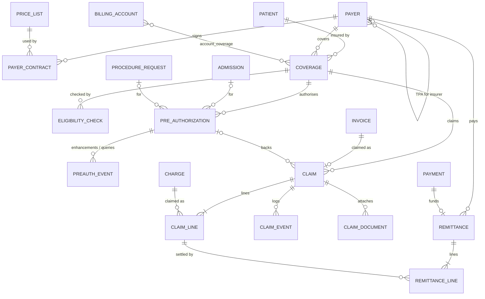

# M12 — Insurance, TPA & government schemes (schema `insurance`)

Each payer interaction is its own record, so local submission, payer acknowledgement, approval and payment are never confused. Settlement money arrives as an M11 payment and is allocated to the payer invoice. Modelled to map onto the **NHCX** (National Health Claims Exchange) FHIR resources — CoverageEligibilityRequest/Response, Claim (preauthorization / claim), ClaimResponse, PaymentReconciliation — with exchanges logged in M16. Can be switched off per tenant via `module_state` (self-pay-only hospitals).

| Table | Key columns | Relationships / constraints |
|---|---|---|
| **payer** | name, payer_type (`insurer`,`tpa`,`government_scheme`,`corporate`), code, irdai_reg_no, nhcx_participant_code, tpa_for_payer_id, gstin, status | Scheme examples: PM-JAY, CGHS, ECHS, state schemes |
| **payer_contract** | valid_from, valid_to, copay_rules jsonb, room_rent_cap_minor, preauth_required_categories text[], credit_days | Payer; contracted price_list (M03) |
| **coverage** | member_no, policy_no, plan_name, policy_holder, relationship_to_holder, sum_insured_minor, balance_minor, valid_from, valid_to, verified_at, priority (`primary`,`secondary`), status | Patient; payer |
| **account_coverage** | sequence | Billing_account ↔ coverage (primary/secondary payer split) |
| **eligibility_check** | requested_at, responded_at, outcome (`eligible`,`not_eligible`,`unknown`), limits jsonb | Coverage; integration_message (M16) |
| **pre_authorization** | requested_minor, approved_minor, payer_ref, valid_until, status (`draft`,`submitted`,`queried`,`approved`,`partially_approved`,`rejected`,`expired`,`enhanced`,`cancelled`) | Coverage; admission, encounter or procedure_request |
| **preauth_event** | kind (`submitted`,`query_raised`,`query_answered`,`enhancement_requested`,`approved`,`rejected`), amount_minor, notes, occurred_at, document_id | Pre_authorization |
| **claim** | claim_no, claim_type (`cashless`,`reimbursement`), total_claimed_minor, submitted_at, status (`draft`,`submitted`,`acknowledged`,`queried`,`adjudicated`,`partially_paid`,`paid`,`denied`,`appealed`,`closed`) | Coverage; billing_account; payer invoice (M11); optional pre_authorization |
| **claim_line** | procedure_code, diagnosis_codes text[] (ICD-10), package_code, claimed_minor, approved_minor, deduction_minor, deduction_reason, denial_reason | Claim; charge (M11) |
| **claim_event** | kind, notes, occurred_at, integration_message_id | Claim status trail |
| **claim_document** | doc_type (`discharge_summary`,`bill`,`reports`,`id_proof`,`query_reply`) | Claim ↔ document (M14) |
| **remittance** / **remittance_line** | received_at, total_minor, tds_minor, utr_no / paid_minor, adjustment_code, adjustment_minor | Payer; payment (M11) / claim_line. Write-offs post as charge adjustments |
