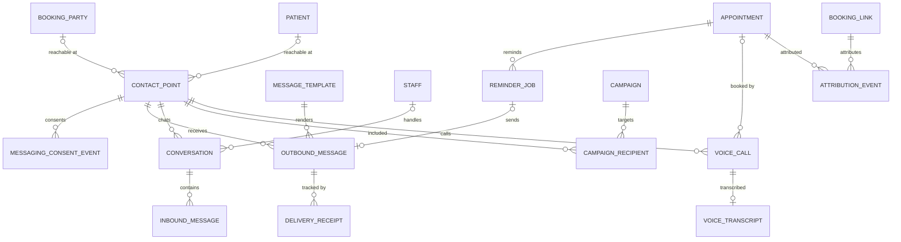

# M13 — Communications & growth (schema `comms`)

WhatsApp reception, reminders, campaigns and voice booking. Messaging consent is an **event log where STOP always wins**; every outbound message has its own delivery state, including `unknown` when a provider times out. Note: WhatsApp Business templates must be approved by Meta per category (utility / marketing / authentication); marketing needs opt-in.

| Table | Key columns | Relationships / constraints |
|---|---|---|
| **contact_point** | channel (`whatsapp`,`sms`,`email`,`voice`), address (E.164 / email), verified_at, status | Booking_party or patient (CHECK one) |
| **messaging_consent_event** | purpose (`care`,`reminders`,`marketing`), action (`opt_in`,`opt_out`,`stop`), source, occurred_at | Contact_point; latest event per purpose decides; `stop` overrides everything until a fresh explicit opt-in |
| **message_template** | channel, name, purpose, category (`utility`,`marketing`,`authentication`), language, body, provider_template_id, approval_status | Used by outbound_message |
| **outbound_message** | purpose, related_type, related_id (appointment / invoice / result…), status (`queued`,`claimed`,`sent`,`delivered`,`read`,`failed`,`unknown`), provider_message_id, claim_token, attempts, sent_at, contains_phi | Contact_point; template. PHI never sent in marketing; results sent as portal links, not content |
| **delivery_receipt** | provider_event_id UQ, provider_status, received_at | Outbound_message |
| **conversation** | status (`bot`,`human_handoff`,`closed`), assigned_staff_id, opened_at, closed_at | Contact_point |
| **inbound_message** | provider_message_id UQ, received_at, body_document_id / body_ref, detected_intent | Conversation |
| **reminder_job** | kind (`day_before`,`same_day`,`follow_up`,`medication`,`vaccination`), due_at, status (`scheduled`,`sent`,`cancelled`,`skipped_no_consent`) | Appointment; outbound_message |
| **campaign** / **campaign_recipient** | purpose (`marketing`,`care_recall`,`health_camp`), audience_definition jsonb, status (`draft`,`approved`,`running`,`done`), approved_by / outbound_message_id, excluded_reason | Contact_point |
| **voice_call** | direction, provider_call_id UQ, started_at, ended_at, outcome (`booked`,`info`,`transferred`,`abandoned`), recording_document_id | Contact_point; optional appointment booked |
| **voice_transcript** | status (`pending_review`,`reviewed`), reviewed_by, reviewed_at, document_id | 1:1 voice_call |
| **booking_link** / **attribution_event** | url, utm_source, utm_campaign, created_by / occurred_at | Practitioner or facility; appointment |
