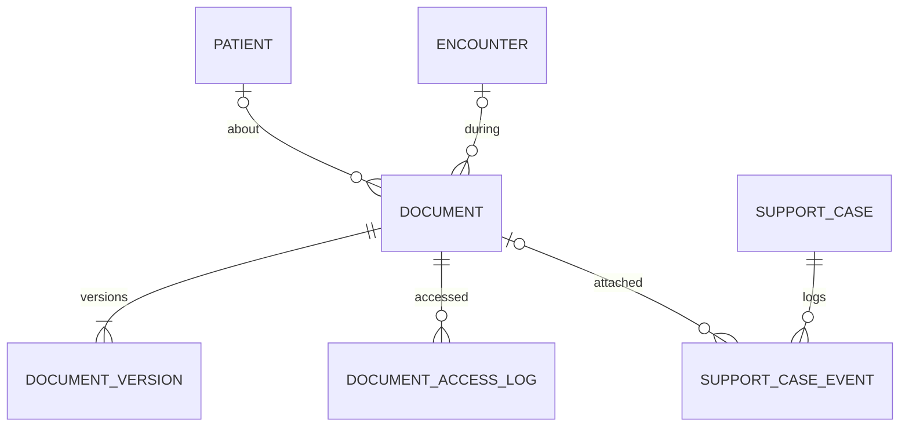
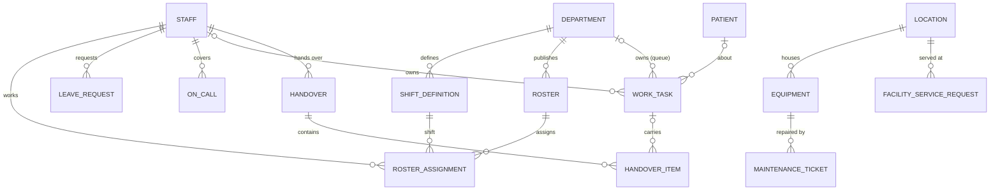
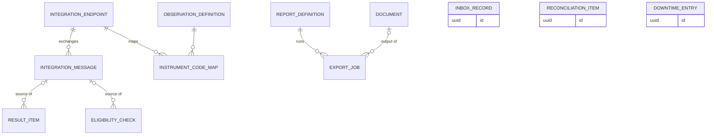

# M14 — Documents & support (schema `documents`)

File metadata only; bytes live in private object storage, addressed by key and checked by SHA-256. Every file has a classification that decides who may open it, and every view/download is logged.

| Table | Key columns | Relationships / constraints |
|---|---|---|
| **document** | classification (`clinical`,`administrative`,`financial`,`recording`,`statutory`,`public_asset`), category (`scan`,`consent_form`,`report_pdf`,`prescription_scan`,`invoice_pdf`,`id_proof`,`photo`,`external_record`,`form_f`,`mccd`…), owner_type, owner_id, mime_type, retain_until, status (`active`,`superseded`,`entered_in_error`) | Optional patient & encounter. Deletion blocked before `retain_until` |
| **document_version** | version_no, storage_key, sha256, size_bytes, uploaded_at, uploaded_by | UQ (document, version_no) |
| **document_access_log** | action (`view`,`download`,`print`,`export`,`share`), occurred_at, staff_id / user_id | Append-only |
| **support_case** / **support_case_event** | channel, category, subject, priority, status (`open`,`pending`,`resolved`,`closed`), assigned_staff_id / kind (`note`,`status_change`,`attachment`), body, occurred_at, document_id | Booking_party or patient |

---

# M15 — Workforce, work queues & facility services (schema `operations`)

Who is on duty, the work waiting for them, and support services. `work_task` is the one queue table behind every departmental worklist: result acknowledgements, pharmacist verifications, cleaning jobs, handover items, discharge clearances — each with an owner and a due time.

| Table | Key columns | Relationships / constraints |
|---|---|---|
| **shift_definition** | name, start_local, end_local, required_skills text[] | Department |
| **roster** / **roster_assignment** | period, status (`draft`,`published`), published_by / staff_id, shift_definition_id, on_date, role | Department. `roster.published` recomputes booking capacity (M04) |
| **leave_request** | starts_on, ends_on, leave_type, status (`requested`,`approved`,`rejected`,`cancelled`), approved_by | Staff; approval flags affected appointments |
| **on_call** | period tstzrange, role | Staff; department |
| **work_task** | kind (`result_ack`,`pharmacy_verification`,`cleaning`,`handover_item`,`nursing_care`,`follow_up`,`discharge_clearance`,`critical_result`,`callback`), source_type, source_id, priority, due_at, status (`open`,`accepted`,`in_progress`,`done`,`rejected`,`cancelled`), accepted_at, completed_at, escalated_at | Optional patient & encounter; owner staff or owner department. UQ (kind, source_type, source_id) WHERE open — no duplicate tasks from redelivered events |
| **handover** / **handover_item** | shift_on, from_staff_id, to_staff_id, status (`sent`,`accepted`), accepted_at / patient_id, summary (SBAR), work_task_id | Department |
| **equipment** | asset_tag UQ, name, kind (`imaging_modality`,`ventilator`,`monitor`,`infusion_pump`,`defibrillator`…), serial_no, aerb_licence_no (radiation equipment), calibration_due_on, status (`in_service`,`down`,`maintenance`,`retired`) | Location; optional schedulable_resource (M04). `down` blocks bookings |
| **maintenance_ticket** | fault, reported_at, resolved_at, status, vendor | Equipment or location; reported_by |
| **facility_service_request** | kind (`dietary`,`porter`,`linen`,`transport`,`biomedical_waste`), details jsonb, status (`requested`,`accepted`,`fulfilled`,`rejected`), fulfilled_at | Optional patient & encounter; location; requested_by, fulfilled_by |

---

# M16 — Integration, reconciliation & reporting (schema `integration`)

Every message exchanged with lab analysers, PACS, payment gateways, payers/NHCX, ABDM gateway and messaging providers, deduplicated by external ID. Audit and outbox live in M01; this module adds consumer checkpoints, reconciliation, downtime recovery and reporting.

| Table | Key columns | Relationships / constraints |
|---|---|---|
| **integration_endpoint** | kind (`lab_instrument`,`pacs`,`payment_gateway`,`whatsapp`,`sms`,`voice`,`payer`,`nhcx`,`abdm_gateway`,`accounting`), name, protocol (`hl7_v2`,`astm`,`dicom`,`fhir`,`rest`), config_ref (secret manager key — no secrets in DB), facility_id, status | — |
| **instrument_code_map** | instrument_code, observation_definition_id | Endpoint; UQ (endpoint, instrument_code) |
| **integration_message** (monthly partitions) | direction (`inbound`,`outbound`), external_id, correlation_id, message_type, status (`received`,`processed`,`failed`,`unmatched`,`duplicate`), payload_document_id / payload_ref, error, received_at | Endpoint; UQ (endpoint, external_id) — processed once |
| **inbox_record** | consumer, event_id, processed_at | UQ (consumer, event_id) — outbox redelivery is harmless |
| **reconciliation_item** | kind (`unmatched_result`,`unknown_payment`,`stock_variance`,`bed_census_mismatch`,`balance_drift`,`claim_mismatch`), source_ref, status (`open`,`resolved`), resolution, resolved_by | Raised by nightly jobs and integrations |
| **downtime_entry** | kind, recorded_offline_at, entered_at, entered_by, reconciled_at, paper_document_id, created_record_type, created_record_id | Links paper work done during an outage to records entered later (true clinical time = `recorded_offline_at`) |
| **report_definition** / **export_job** | code, name, source_view, freshness_minutes, owner / scope jsonb, status (`requested`,`running`,`ready`,`expired`), requested_by, document_id | Exports are audited (DPDP) |
