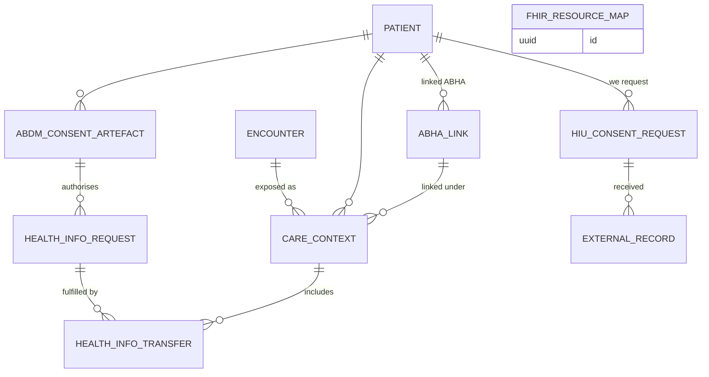

# M17 — ABDM & FHIR interoperability (schema `abdm`)

Not covered by either reviewed document. Makes the hospital an ABDM **HIP** (shares records with the patient's consent) and optionally an **HIU** (fetches records from other providers). Records stay in our relational tables; FHIR R4 bundles following the **NRCeS ABDM implementation guide** are generated on demand from them (projection), encrypted and pushed. This module replaces what Medplum would otherwise provide.

| Table | Key columns | Relationships / constraints |
|---|---|---|
| **abha_link** | abha_number, abha_address, linked_at, link_method (`otp`,`face_auth`,`scan_and_share`), status (`linked`,`unlinked`), kyc_verified | Patient (identifier also in `patient_identifier`) |
| **care_context** | care_context_ref UQ, display, hi_types text[] (`OPConsultation`,`Prescription`,`DiagnosticReport`,`DischargeSummary`,`ImmunizationRecord`,`WellnessRecord`,`HealthDocumentRecord`), linked_at, link_initiator (`hip`,`patient`), status | Encounter; patient; abha_link |
| **abdm_consent_artefact** | artefact_id UQ, purpose, hi_types text[], date_range daterange, expires_at, requester_hiu, status (`granted`,`revoked`,`expired`), received_at, raw_document_id | Patient. Revocation stops all further transfers |
| **health_info_request** | transaction_id UQ, requested_range daterange, data_push_url, key_material_ref, status (`received`,`processing`,`transferred`,`failed`,`rejected`), received_at | Consent artefact |
| **health_info_transfer** | bundle_hash, entry_count, pushed_at, ack_status, error | Request ↔ care_context; log of exactly what was shared (DPDP accountability) |
| **hiu_consent_request** / **external_record** | purpose, hi_types, date_range, status / source_hip, bundle_document_id, received_at | We are the HIU; external bundles stored as documents, optionally reconciled into the chart |
| **fhir_resource_map** | local_type, local_id, local_version, fhir_type, fhir_id, last_projected_at | Stable FHIR IDs for projected resources (used by ABDM and NHCX bundles, and a future FHIR API) |

ABDM and NHCX message envelopes are logged in M16 `integration_message`.
