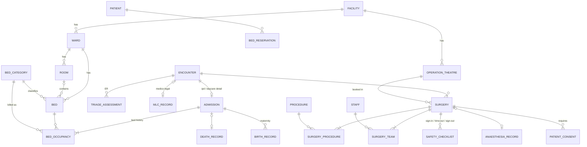

# Layer 3 — IPD, Operation Theatre & Emergency (v1.0)

Depends on: Layers 1–2. Global conventions from Layer 1 apply.
Requires extension: `btree_gist` (exclusion constraints on ranges).

## Diagram

## Tables

### Locations & beds

**ward**
- `id`, `tenant_id`, `facility_id`, `department_id` (nullable), `code` (UNIQUE per facility), `name`, `floor`
- `ward_type` CHECK (`general`,`icu`,`nicu`,`picu`,`hdu`,`maternity`,`isolation`,`daycare`,`emergency`,`burns`,`dialysis`)
- `gender_restriction` CHECK (`male`,`female`,`any`), `is_active`

**room** — `id`, `tenant_id`, `ward_id`, `code`, `name`, `is_active` (optional level; open wards put beds directly under ward)

**bed_category** — tenant-defined billing class, e.g. General, Semi-Private, Private, Deluxe, ICU
- `id`, `tenant_id`, `code`, `name`, `rank int` (for upgrade/downgrade logic), `is_active`
- Tariffs attach in Layer 6.

**bed**
- `id`, `tenant_id`, `ward_id`, `room_id` (nullable), `code` (UNIQUE per ward), `bed_category_id`
- `operational_status` CHECK (`in_service`,`cleaning`,`maintenance`,`blocked`), `is_active`
- **Occupancy is not stored on `bed`** — it is derived from `bed_occupancy` (a cached flag would drift). A view `bed_board` joins both for the live ward dashboard.

**bed_reservation** — planned admissions
- `id`, `tenant_id`, `patient_id`, `facility_id`, `bed_id` (nullable), `bed_category_id`, `expected_period tstzrange`
- `status` CHECK (`held`,`converted`,`cancelled`,`expired`), `converted_admission_id`

### Admission

**admission** — 1:1 extension of an `ipd` / `daycare` encounter
- `encounter_id` PK + FK, `tenant_id`, `admission_no` (IP number, UNIQUE per tenant)
- `admitted_at`, `admission_type` CHECK (`elective`,`emergency`,`daycare`,`maternity`,`transfer_in`)
- `admission_source` CHECK (`opd`,`emergency`,`direct`,`external_referral`), `source_encounter_id`
- `admitting_staff_id`, `admission_reason`, `expected_los_days`, `requested_bed_category_id`
- Discharge: `discharge_status` CHECK (`admitted`,`discharge_advised`,`billing_clearance`,`discharged`), `discharge_advised_at`, `discharged_at`, `discharged_by`
- `discharge_type` CHECK (`routine`,`lama`,`dama`,`absconded`,`transferred_out`,`referred`,`death`) — LAMA/DAMA documented with consent form reference
- `discharge_summary_note_id` (FK → `clinical_note` with `note_type='discharge_summary'`)
- Trigger: owning encounter must have `encounter_class IN ('ipd','daycare')`

**bed_occupancy** — every bed a patient has held (transfers = new rows)
- `id`, `tenant_id`, `admission_id`, `bed_id`, `period tstzrange` (open upper bound = current)
- `kind` CHECK (`primary`,`retained`) — `retained` = room kept while patient is in ICU (common, and billable)
- `billed_bed_category_id` — usually = bed's category; differs when the hospital moves a patient to a higher bed for its own reasons and bills the lower class
- `transfer_reason`, `ordered_by`
- Constraints:
  - `EXCLUDE USING gist (bed_id WITH =, period WITH &&)` — one patient per bed at a time
  - `EXCLUDE USING gist (admission_id WITH =, period WITH &&) WHERE (kind = 'primary')` — one primary bed per patient at a time

**bed_charge_rule** — tenant-configurable day-counting (decision D12)
- `id`, `tenant_id`, `facility_id` (nullable = tenant default), `payer_type` (nullable; filled in Layer 6 to allow TPA-specific rules)
- `method` CHECK (`midnight_census`,`per_24h_from_admit`,`calendar_day_any_part`)
- `grace_minutes int` (e.g. discharge within N minutes of the boundary is not charged another day), `half_day_after_minutes` (nullable), `valid_from`, `valid_to`
- Billing engine (Layer 6) walks `bed_occupancy` with this rule.

### Birth & death

**birth_record**
- `id`, `tenant_id`, `admission_id` (mother's), `mother_patient_id`, `baby_patient_id` (baby registered as its own patient)
- `born_at`, `sex`, `birth_weight_g`, `gestation_weeks`, `delivery_method` CHECK (`normal_vaginal`,`assisted_vaginal`,`lscs`,`other`), `birth_order` (twins), `apgar_1min`, `apgar_5min`, `is_live_birth`
- `attended_by`, `civil_registration_ref` (RBD Act registration number), `reported_at`

**death_record**
- `id`, `tenant_id`, `encounter_id`, `patient_id`, `died_at`, `pronounced_by`
- `cause_immediate_concept_id`, `cause_antecedent jsonb` (ordered chain), `contributing_conditions jsonb`, `manner` CHECK (`natural`,`accident`,`suicide`,`homicide`,`pending_investigation`,`undetermined`)
- `mccd_form` CHECK (`form_4`,`form_4a`), `mccd_issued_at`, `certified_by` — Medical Certificate of Cause of Death under the RBD Act
- `is_mlc` (→ `mlc_record`), `post_mortem_required`, `body_released_to`, `body_released_at`
- Trigger sets `patient.deceased_at`

### Emergency

**triage_assessment** — repeatable (re-triage allowed)
- `id`, `tenant_id`, `encounter_id`, `triaged_at`, `triaged_by`
- `level` CHECK (`red`,`yellow`,`green`,`black`), `arrival_mode` CHECK (`walk_in`,`ambulance_108`,`private_ambulance`,`police`,`referred`), `vital_set_id`, `chief_complaint`, `notes`

**mlc_record** — Medico-Legal Case (restricted visibility; separate permission `mlc.read`)
- `id`, `tenant_id`, `facility_id`, `encounter_id` (UNIQUE), `patient_id`, `mlc_no` (sequential, UNIQUE per facility)
- `mlc_type` CHECK (`road_traffic`,`assault`,`burns`,`poisoning`,`fall`,`sexual_assault`,`animal_bite`,`industrial`,`suspected_suicide`,`brought_dead`,`other`)
- `incident_at`, `incident_place`, `brought_by_name`, `brought_by_relation`, `brought_by_phone`
- `police_station`, `police_intimated_at`, `intimation_mode` CHECK (`phone`,`written`,`in_person`), `intimation_ref`, `officer_name`, `officer_badge_no`
- `injury_details jsonb`, `examined_by`, `wound_certificate_issued_at`, `evidence_handover jsonb` (samples/clothes, chain of custody), `is_pocso` (child sexual offence — mandatory reporting)
- Schema does **not** make treatment wait on police fields; all intimation columns are nullable (emergency care must not be delayed for police formalities).

### Operation theatre

**operation_theatre** — `id`, `tenant_id`, `facility_id`, `code`, `name`, `ot_type` CHECK (`major`,`minor`,`cath_lab`,`endoscopy`,`labour_room`), `is_active`

**procedure** — procedure master (global + tenant additions)
- `id`, `tenant_id` (NULL = global), `code`, `name`, `snomed_concept_id`, `specialty_id`
- `surgery_grade` CHECK (`minor`,`intermediate`,`major`,`supra_major`) — TPA tariffs in India often key on grade
- `default_duration_min`, `is_active`

**surgery**
- `id`, `tenant_id`, `encounter_id` (ipd/daycare/emergency), `patient_id`, `ot_id`
- `scheduled tstzrange`, `priority` CHECK (`elective`,`urgent`,`emergency`)
- `status` CHECK (`requested`,`scheduled`,`confirmed`,`in_progress`,`completed`,`postponed`,`cancelled`), `cancel_reason`
- Actual timeline: `in_room_at`, `anaesthesia_start_at`, `incision_at`, `closure_at`, `out_of_room_at` (CHECKs keep them ordered)
- `anaesthesia_type` CHECK (`general`,`spinal`,`epidural`,`regional_block`,`local`,`sedation`,`none`), `asa_class smallint` CHECK 1–6
- `pre_op_diagnosis_text`, `post_op_diagnosis_text`, `operative_note_id` (→ `clinical_note`)
- `EXCLUDE USING gist (ot_id WITH =, scheduled WITH &&) WHERE (status NOT IN ('cancelled','postponed'))`
- Surgeon double-booking spans tables → enforced by trigger on `surgery_team`

**surgery_procedure** — `id`, `surgery_id`, `procedure_id`, `is_primary`, `laterality` CHECK (`left`,`right`,`bilateral`,`not_applicable`)

**surgery_team** — `id`, `surgery_id`, `staff_id`, `role` CHECK (`primary_surgeon`,`assistant_surgeon`,`anaesthetist`,`scrub_nurse`,`circulating_nurse`,`perfusionist`,`technician`) — drives professional-fee billing in Layer 6

**safety_checklist** — WHO Surgical Safety Checklist
- `id`, `surgery_id`, `phase` CHECK (`sign_in`,`time_out`,`sign_out`), `responses jsonb`, `completed_by`, `completed_at`; UNIQUE (`surgery_id`,`phase`)
- Trigger: `surgery.incision_at` can't be set before `time_out` exists

**anaesthesia_record**
- `surgery_id` PK/FK, `pac_done_at`, `pac_by`, `pac_outcome` CHECK (`fit`,`fit_with_risk`,`unfit`,`deferred`), `airway_assessment jsonb`, `intraop_data jsonb`, `recovery_handover_at`, `aldrete_score`
- Implants and OT consumables are recorded as stock consumption in Layer 5 (batch/serial traceability).

### Nursing
Phase 1 (decision D14): nursing notes use `clinical_note` (`note_type='nursing'`) and vitals use `vital_set`. No MAR, intake/output or care-plan tables yet. Adding a MAR later means one new table (`medication_administration`) referencing `prescription_item` — no restructuring.

## Decisions log
| # | Decision | Chosen |
|---|---|---|
| D12 | Bed-day counting | Configurable rule per tenant/facility (later per payer) |
| D13 | OT | In scope: theatre booking, team, WHO checklist, anaesthesia record |
| D14 | Nursing | Notes + vitals only; MAR deferred |
| D15 | Emergency | Colour triage (red/yellow/green/black) + MLC register |
| D16 | Bed occupancy | Derived from history table, not a status flag |
