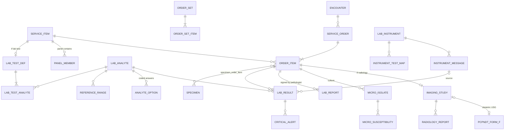

# Layer 4 — Orders & Diagnostics (v1.0)

Depends on: Layers 1–3. Global conventions from Layer 1 apply.

## Diagram

## Tables

### Service catalogue

**service_item** — the single master of everything orderable *and* chargeable (Layer 6 attaches tariffs here)
- `id`, `tenant_id`, `code` (UNIQUE per tenant), `name`, `short_name`
- `category` CHECK (`consultation`,`lab_test`,`lab_panel`,`radiology`,`procedure`,`surgery_package`,`bed_charge`,`nursing`,`diet`,`physiotherapy`,`referral`,`equipment`,`misc`)
- `performing_department_id`, `procedure_id` (nullable → Layer 3), `concept_id` (LOINC / SNOMED)
- `is_orderable`, `is_chargeable`, `requires_consent`, `patient_prep_instructions`, `sac_code` (GST service code — used in Layer 6), `is_active`

**panel_member** — panels/profiles (e.g. Lipid Profile → individual tests)
- `panel_item_id`, `member_item_id`, `sequence`; PK both; CHECK no self-reference

**order_set** / **order_set_item** — doctor/department favourites
- `order_set`: `id`, `tenant_id`, `owner_staff_id` (nullable = department set), `department_id`, `name`
- `order_set_item`: `order_set_id`, `service_item_id`, `default_priority`, `default_details jsonb`

### Lab test definitions

**lab_test_def** — 1:1 with a `service_item` of category `lab_test`
- `service_item_id` PK/FK, `section` CHECK (`biochemistry`,`haematology`,`clinical_pathology`,`microbiology`,`serology`,`histopathology`,`cytology`,`molecular`,`immunology`)
- `specimen_type` CHECK (`whole_blood`,`serum`,`plasma`,`urine`,`stool`,`csf`,`sputum`,`swab`,`tissue`,`fluid`,`other`)
- `container_type` CHECK (`edta`,`plain`,`sst`,`fluoride`,`citrate`,`heparin`,`sterile_container`,`other`), `min_volume_ml`, `tat_minutes`, `method`

**lab_analyte** — a single reportable parameter (Hb, WBC, Glucose…)
- `id`, `tenant_id`, `code`, `name`, `loinc_concept_id`
- `result_type` CHECK (`numeric`,`text`,`coded`,`titre`,`culture`), `unit` (UCUM), `decimal_places`

**lab_test_analyte** — `test_item_id`, `analyte_id`, `sequence`, `is_reportable`

**reference_range** — age/sex-specific
- `id`, `tenant_id`, `analyte_id`, `sex` CHECK (`male`,`female`,`any`), `age_min_days`, `age_max_days` (days so neonatal ranges work)
- `low`, `high`, `critical_low`, `critical_high`, `text_range` (for non-numeric), `method` (nullable), `valid_from`, `valid_to`

**analyte_option** — coded answers: `id`, `analyte_id`, `code`, `display`, `is_abnormal` (e.g. Positive / Negative / Reactive)

### Orders (CPOE)

**service_order** — one ordering event
- `id`, `tenant_id`, `facility_id`, `encounter_id`, `patient_id`, `order_no` (UNIQUE per tenant)
- `ordered_by`, `ordered_at`, `priority` CHECK (`routine`,`urgent`,`stat`), `indication`, `status` CHECK (`draft`,`placed`,`cancelled`) — progress is tracked per item

**order_item**
- `id`, `tenant_id`, `order_id`, `service_item_id`, `quantity`, `priority` (inherits, overridable)
- `status` CHECK (`ordered`,`scheduled`,`sample_pending`,`collected`,`in_progress`,`resulted`,`verified`,`cancelled`)
- `performing_department_id`, `target_staff_id` (for referrals / internal consults), `scheduled_at`, `details jsonb` (diet type, physio instructions, consult reason)
- `cancelled_by`, `cancelled_reason`, `panel_parent_item_id` (when a panel is exploded into tests)
- Billing (Layer 6) creates a charge per `order_item`

### Specimens

**specimen**
- `id`, `tenant_id`, `facility_id`, `patient_id`, `barcode` (UNIQUE per tenant), `specimen_type`, `container_type`
- `status` CHECK (`pending_collection`,`collected`,`received`,`rejected`,`processed`,`stored`,`disposed`)
- `collected_at`, `collected_by`, `collection_site`, `received_at`, `received_by`
- `rejection_reason` CHECK (`haemolysed`,`clotted`,`insufficient`,`mislabelled`,`wrong_container`,`delayed`,`other`), `rejected_by`, `recollection_of_id` (self-FK)

**specimen_order_item** — M:N (one tube serves many tests; GTT needs many tubes): `specimen_id`, `order_item_id`; PK both

### Results

**lab_result** — one row per analyte value
- `id`, `tenant_id`, `order_item_id`, `analyte_id`, `patient_id`, `specimen_id`
- `value_numeric`, `value_text`, `value_option_id`; CHECK at least one is set
- Snapshots: `unit`, `ref_low`, `ref_high`, `ref_text` (what the report said at the time)
- `flag` CHECK (`normal`,`low`,`high`,`critical_low`,`critical_high`,`abnormal`)
- `status` CHECK (`preliminary`,`final`,`corrected`,`cancelled`), `corrected_from_id` (self-FK)
- `source` CHECK (`manual`,`instrument`), `instrument_message_id`, `entered_by`, `entered_at`
- Partial UNIQUE (`order_item_id`,`analyte_id`) WHERE `status IN ('preliminary','final')` — one current value

**lab_report** — authorised release (NABL needs a named authorised signatory)
- `id`, `tenant_id`, `order_item_id`, `version`, `status` CHECK (`draft`,`verified`,`released`,`amended`)
- `technician_id`, `verified_by` (pathologist / microbiologist), `verified_at`, `released_at`, `interpretation`, `document_id` (PDF), `amends_report_id`
- Released reports immutable; corrections → new version

**critical_alert** — documented communication of critical values (NABH/NABL)
- `id`, `tenant_id`, `lab_result_id`, `notified_by`, `notified_to_staff_id`, `notified_to_name`, `notified_at`, `channel` CHECK (`phone`,`in_person`,`app`), `read_back_confirmed bool`

**micro_isolate** — `id`, `order_item_id`, `organism_concept_id`, `colony_count`, `growth_text`, `sequence`
**micro_susceptibility** — `id`, `isolate_id`, `antibiotic_drug_id` (→ `drug`), `method` CHECK (`disc`,`mic`), `mic_value`, `zone_mm`, `interpretation` CHECK (`S`,`I`,`R`)

### Instrument-ready (populated later)

**lab_instrument** — `id`, `tenant_id`, `facility_id`, `name`, `model`, `serial_no`, `protocol` CHECK (`hl7_v2`,`astm`,`other`), `is_active`
**instrument_test_map** — `instrument_id`, `analyte_id`, `instrument_code`; UNIQUE (`instrument_id`,`instrument_code`)
**instrument_message** — partitioned by month: `id`, `tenant_id`, `instrument_id`, `direction` CHECK (`in`,`out`), `received_at`, `raw_payload text`, `parse_status` CHECK (`pending`,`parsed`,`error`), `error`

### Radiology

**imaging_study** — 1:1 with a radiology `order_item`
- `id`, `tenant_id`, `order_item_id` UNIQUE, `patient_id`, `facility_id`
- `modality` CHECK (`CR`,`DX`,`CT`,`MR`,`US`,`MG`,`NM`,`PT`,`XA`,`RF`) — DICOM modality codes
- `accession_no` (UNIQUE per facility — key for DICOM Modality Worklist), `study_instance_uid` (UNIQUE, from PACS)
- `status` CHECK (`scheduled`,`arrived`,`in_progress`,`completed`,`reported`,`cancelled`), `scheduled_at`, `performed_at`, `technologist_id`, `device_name`
- `contrast_used`, `contrast_drug_id`, `dose_dlp_mgy_cm` (CT dose), `pacs_viewer_url`

**radiology_report**
- `id`, `tenant_id`, `study_id`, `findings`, `impression`, `template_id`, `data jsonb`
- `status` CHECK (`draft`,`preliminary`,`final`,`addendum`), `reported_by`, `signed_at`, `addendum_of_id`; final reports immutable

**pcpndt_form_f** — PC-PNDT Act: mandatory Form F for every ultrasound on a pregnant woman
- `id`, `tenant_id`, `facility_id`, `study_id` UNIQUE, `patient_id`, `form_data jsonb` (indication, LMP, children's details, referral, etc.)
- `patient_declaration_at`, `doctor_declaration_by`, `doctor_declaration_at`
- `reporting_month date`, `submitted_to_authority_at` (monthly submission to the Appropriate Authority)
- Retention: the Act requires records to be kept for 2 years — `deleted_at` blocked by trigger within that period
- App rule: USG studies flagged obstetric can't be marked `completed` without a Form F

## Decisions log
| # | Decision | Chosen |
|---|---|---|
| D17 | Orders | Unified `service_order` / `order_item`; `service_item` is also the billing master |
| D18 | Lab analysers | Manual entry now; instrument tables present for HL7/ASTM later |
| D19 | Outsourcing | Not modelled (in-house only) |
| D20 | Radiology | Reports + PACS references (accession no., Study Instance UID, viewer URL) |
| D21 | Result integrity | Snapshots of units/ranges; released reports versioned, never edited |
