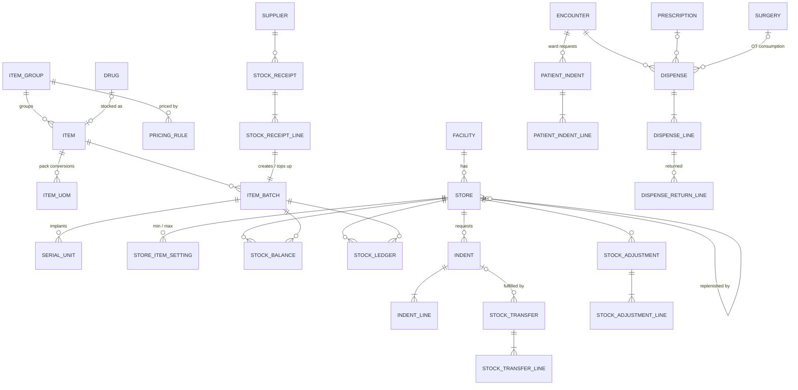

# Layer 5 — Pharmacy & Inventory (v1.0)

Depends on: Layers 1–4. Global conventions from Layer 1 apply.

## Diagram

## Tables

### Item master

**item_group** — pricing & reporting group (e.g. Tablets, Injectables, Implants, Surgical Consumables)
- `id`, `tenant_id`, `parent_id`, `code`, `name`

**item** — everything stockable
- `id`, `tenant_id`, `code` (UNIQUE per tenant), `name`, `item_group_id`
- `item_type` CHECK (`drug`,`consumable`,`implant`,`reagent`,`general`)
- `drug_id` (nullable, UNIQUE → Layer 2 `drug`; required when `item_type='drug'`)
- `base_uom` (smallest issuable unit, e.g. `tablet`, `ml`, `piece`), `hsn_code`
- Tracking flags: `is_batch_tracked`, `is_expiry_tracked`, `is_serial_tracked` (implants, required for recall traceability)
- `is_controlled` (derived from drug schedule H1 / X / NDPS), `is_chargeable` (some consumables are absorbed into packages), `is_active`
- `service_item_id` (nullable → Layer 4) when the item is billed as a service

**item_uom** — pack conversions: `item_id`, `uom` (e.g. `strip`, `box`), `factor_to_base` (strip = 10 tablets), `is_purchase_uom`, `is_issue_uom`
- **All stock quantities are stored in base units** — no fractional-strip bugs

**pricing_rule** — decision D24 (configurable per item group)
- `id`, `tenant_id`, `item_group_id`, `payer_type` (nullable — Layer 6 can give insurers/corporates different rates), `encounter_class` (nullable)
- `method` CHECK (`mrp_less_discount`,`cost_plus_markup`), `percent numeric`, `valid_from`, `valid_to`
- Selling price per base unit:
  - `mrp_less_discount` → `batch.mrp × (1 − percent/100)`
  - `cost_plus_markup` → `LEAST(batch.purchase_rate × (1 + percent/100), batch.mrp)`
- Hard CHECK at dispense: `unit_price ≤ mrp_per_base_unit` (selling above MRP is illegal)

### Stores & batches

**store**
- `id`, `tenant_id`, `facility_id`, `code`, `name`
- `store_type` CHECK (`central`,`pharmacy`,`ward`,`ot`,`icu`,`lab`,`emergency`), `ward_id` / `department_id` (nullable), `parent_store_id` (normal replenishment source)
- `can_dispense_to_patient`, `drug_licence_no` (retail licence for dispensing pharmacies), `is_active`

**store_item_setting** — `store_id`, `item_id`, `min_level`, `max_level`, `reorder_qty`, `bin_location`; PK both

**supplier** — `id`, `tenant_id`, `name`, `gstin`, `state_code`, `drug_licence_no` (wholesale), `phone`, `email`, `address`, `is_active`

**item_batch**
- `id`, `tenant_id`, `item_id`, `batch_no`, `manufactured_on`, `expiry_date`
- `mrp_per_base_unit`, `purchase_rate_per_base_unit` (net of discounts, excl. GST), `gst_rate_on_purchase`, `supplier_id`
- UNIQUE (`tenant_id`,`item_id`,`batch_no`)
- Expired batches are blocked from issue by CHECK in the stock-out function (FEFO picks earliest non-expired)

**serial_unit** — implants / serialised devices
- `id`, `tenant_id`, `item_id`, `batch_id`, `serial_no`, `store_id` (current), `status` CHECK (`in_stock`,`in_transit`,`issued`,`implanted`,`returned_to_vendor`,`written_off`)
- UNIQUE (`tenant_id`,`item_id`,`serial_no`)

### Stock movement (ledger is the source of truth)

**stock_ledger** — append-only, partitioned by month
- `id`, `tenant_id`, `store_id`, `item_id`, `batch_id`, `serial_unit_id`, `qty_change` (signed, base units), `unit_cost`
- `txn_type` CHECK (`opening`,`receipt`,`transfer_out`,`transfer_in`,`dispense`,`patient_return`,`adjustment`,`expiry_writeoff`,`damage`)
- Exactly one source reference (CHECK `num_nonnulls(...) = 1`): `receipt_line_id`, `transfer_line_id`, `dispense_line_id`, `return_line_id`, `adjustment_line_id`
- `occurred_at`, `performed_by`

**stock_balance** — current quantity per store+batch, maintained by trigger from the ledger
- PK (`store_id`,`batch_id`), `tenant_id`, `item_id`, `qty_on_hand` CHECK `>= 0`
- `SELECT … FOR UPDATE` on this row during issue prevents two counters overselling the same batch
- A nightly job reconciles balance vs `SUM(ledger)` and alerts on drift

**stock_receipt** — minimal goods receipt (decision D23; PR/PO/vendor-invoice matching comes later and will reference this)
- `id`, `tenant_id`, `store_id`, `supplier_id`, `supplier_invoice_no`, `supplier_invoice_date`, `received_at`, `received_by`, `status` CHECK (`draft`,`posted`,`cancelled`)
- UNIQUE (`tenant_id`,`supplier_id`,`supplier_invoice_no`) — no double-entry of the same invoice

**stock_receipt_line** — `id`, `receipt_id`, `item_id`, `batch_no`, `expiry_date`, `mrp`, `purchase_rate`, `uom`, `qty`, `free_qty`, `gst_rate`, `batch_id` (set on posting), `serial_nos text[]` (for serial-tracked items)

**indent** — store-to-store request
- `id`, `tenant_id`, `requesting_store_id`, `issuing_store_id`, `status` CHECK (`draft`,`submitted`,`partially_issued`,`issued`,`cancelled`), `requested_by`, `requested_at`, `priority`
**indent_line** — `id`, `indent_id`, `item_id`, `qty_requested`, `qty_issued`

**stock_transfer** — `id`, `tenant_id`, `indent_id` (nullable), `from_store_id`, `to_store_id`, `status` CHECK (`in_transit`,`received`,`partially_received`), `dispatched_at`, `dispatched_by`, `received_at`, `received_by`
**stock_transfer_line** — `id`, `transfer_id`, `batch_id`, `serial_unit_id`, `qty_sent`, `qty_received`, `discrepancy_reason`

**stock_adjustment** — `id`, `tenant_id`, `store_id`, `reason` CHECK (`physical_count`,`damage`,`expiry`,`theft_loss`,`other`), `notes`, `requested_by`, `approved_by`, `approved_at`
**stock_adjustment_line** — `id`, `adjustment_id`, `batch_id`, `system_qty`, `counted_qty`, `qty_change`

### Dispensing (registered patients only — decision D25)

**patient_indent** — ward/OT nurse requests drugs for an inpatient
- `id`, `tenant_id`, `encounter_id`, `requesting_store_id` (ward), `pharmacy_store_id`, `requested_by`, `requested_at`, `status` CHECK (`submitted`,`partially_dispensed`,`dispensed`,`cancelled`)
**patient_indent_line** — `id`, `patient_indent_id`, `prescription_item_id` (nullable — consumables have no Rx), `item_id`, `qty_requested`

**dispense**
- `id`, `tenant_id`, `store_id`, `patient_id`, `encounter_id` (NOT NULL), `dispense_no`
- `dispense_type` CHECK (`opd_prescription`,`ipd_indent`,`ot_consumption`,`emergency`)
- `prescription_id`, `patient_indent_id`, `surgery_id` (each nullable, matched to type by CHECK)
- `prescription_document_id` (scanned Rx — required for Schedule X)
- `dispensed_by`, `dispensed_at`, `status` CHECK (`completed`,`cancelled`)

**dispense_line**
- `id`, `tenant_id`, `dispense_id`, `item_id`, `batch_id`, `serial_unit_id`, `prescription_item_id`, `qty` (base units)
- Price snapshot: `mrp_per_base_unit`, `unit_price`, `pricing_rule_id`, `discount_amount`
- CHECK `unit_price <= mrp_per_base_unit`
- Layer 6 raises a patient charge per line (or marks it package-inclusive)

**dispense_return** / **dispense_return_line** — unused IPD medicines returned to pharmacy
- `dispense_return`: `id`, `tenant_id`, `store_id`, `encounter_id`, `returned_by`, `received_by`, `received_at`
- `dispense_return_line`: `id`, `return_id`, `dispense_line_id`, `qty` (CHECK ≤ dispensed − already returned), `restockable bool` (cold-chain / opened items go to write-off)

### Compliance views (derived, no extra tables)
- **Schedule H1 register** — view over `dispense_line ⋈ drug(regulatory_schedule='H1')` giving date, patient name/address, prescriber name/reg. no., drug, qty. Drugs Rules require this register to be kept for 3 years → retention trigger blocks deletes.
- **Schedule X / NDPS register** — same pattern; the dispense must carry a prescription document.
- **Implant traceability** — `serial_unit → dispense_line → dispense.surgery_id → patient`, used for manufacturer recalls.
- **Near-expiry report** — `stock_balance ⋈ item_batch` where `expiry_date < now() + interval '90 days'`.

## Deferred
- Purchase requisition, purchase order + approval, vendor invoice matching, return to vendor, vendor payments (decision D23) — will reference `supplier`, `stock_receipt`.
- Walk-in retail (OTC) sales (D25).

## Decisions log
| # | Decision | Chosen |
|---|---|---|
| D22 | Inventory scope | Pharmacy + consumables, implants (serial-tracked), reagents, general stores |
| D23 | Procurement | Deferred; minimal goods receipt kept so batches, expiry, MRP and cost exist |
| D24 | Selling price | Per item group: MRP − discount or cost + markup (capped at MRP) |
| D25 | Dispensing | Registered patients only, always tied to an encounter |
| D26 | Stock model | Append-only ledger + trigger-maintained balance; base units only; FEFO |
