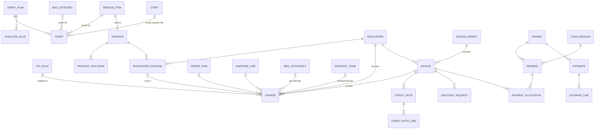

# Layer 6 — Billing (self-pay) (v1.0)

Depends on: Layers 1–5. Global conventions from Layer 1 apply.
Money columns: `numeric(12,2)`; all line amounts stored (never recomputed from current tariffs).

## Diagram

## Tables

### Pricing

**tariff_plan** — a rate card. Phase 1: one default "Standard" plan per tenant (plus optional ones like "Staff" or "Senior citizen"). Future insurer / scheme rate cards are just more plans.
- `id`, `tenant_id`, `code`, `name`, `is_default` (partial UNIQUE: one default per tenant), `valid_from`, `valid_to`

**tariff** — price of a service
- `id`, `tenant_id`, `tariff_plan_id`, `service_item_id`
- `bed_category_id` (nullable = applies to OPD / any class), `encounter_class` (nullable), `staff_id` (nullable = doctor-specific consultation fee)
- `price`, `is_price_editable` (e.g. misc charges), `valid_from`, `valid_to`
- Exclusion constraint on overlapping validity for the same key; NULLs handled with `COALESCE(col, '00000000-0000-0000-0000-000000000000')` expressions, since plain `NULL = NULL` would not conflict
- Lookup order: most specific match wins (staff > bed category > encounter class > generic)

**team_fee_rule** — surgical team fees as % of the primary surgeon's fee
- `id`, `tenant_id`, `tariff_plan_id`, `role` (from `surgery_team.role`), `percent_of_surgeon_fee`, `valid_from`, `valid_to`

**tax_rule** — GST as configurable data, not code (rates and exemptions change; the tenant's CA configures them)
- `id`, `tenant_id` (NULL = system default), `hsn_sac_code` (nullable), `service_category` (nullable), `item_type` (nullable), `encounter_class` (nullable)
- `min_unit_price` (nullable — e.g. room-rent threshold rules), `excluded_bed_ward_types text[]` (e.g. ICU exclusions)
- `gst_rate`, `cess_rate`, `itc_allowed bool`, `priority`, `valid_from`, `valid_to`, `legal_reference` (notification no.)
- Seeded examples (verify with a tax advisor before go-live): healthcare services by a clinical establishment → exempt; non-ICU room rent above the notified per-day threshold → 5% without ITC; OPD pharmacy sales → rate by HSN; inpatient medicines as part of treatment → exempt (composite healthcare supply)
- Intra-state supply → CGST + SGST split; IGST columns kept for completeness

### Packages

**package** — fixed-price bundle (maternity, cataract, appendectomy…); billed via its own `service_item` (category `surgery_package`) so the `tariff` table prices it per bed category
- `id`, `tenant_id`, `service_item_id` UNIQUE, `name`, `included_los_days`, `max_bed_category_rank`, `procedure_id` (nullable), `valid_from`, `valid_to`, `is_active`

**package_inclusion**
- `id`, `package_id`, `kind` CHECK (`service_item`,`service_category`,`item`,`item_group`,`bed_days`)
- Target: `service_item_id` / `service_category` / `item_id` / `item_group_id` (CHECK exactly one, per `kind`)
- `qty_limit` (nullable), `amount_limit` (nullable) — usage beyond limits bills normally

**encounter_package** — package applied to a stay
- `id`, `tenant_id`, `encounter_id`, `package_id`, `price_snapshot`, `applied_by`, `applied_at`, `status` CHECK (`active`,`removed`)

### Charges (posted as services happen)

**charge** — one billable line; the core of billing
- `id`, `tenant_id`, `facility_id`, `encounter_id`, `patient_id`, `charge_date`
- What: `service_item_id` or `item_id` (CHECK one), `description` (snapshot), `qty`, `unit_price`, `tariff_id` (which rate was used)
- Source (CHECK at most one; NULL = manual charge): `order_item_id`, `dispense_line_id`, `bed_occupancy_id`, `surgery_team_id`, `appointment_id`
- Package: `encounter_package_id`, `is_package_inclusive` (inclusive lines show on the bill at ₹0 net, for transparency)
- Amounts: `gross_amount`, `discount_amount`, `taxable_amount`, `gst_rate`, `cgst`, `sgst`, `igst`, `net_amount`, `tax_rule_id`
- `status` CHECK (`posted`,`invoiced`,`cancelled`), `invoice_id`, `posted_by`, `posted_at`, `cancelled_by`, `cancel_reason`
- **No double charging** — partial UNIQUE indexes WHERE `status <> 'cancelled'`: (`order_item_id`), (`dispense_line_id`), (`bed_occupancy_id`,`charge_date`), (`surgery_team_id`)
- Invoiced charges immutable; corrections via credit note
- Bed-day charges are generated by a daily job walking `bed_occupancy` with `bed_charge_rule` (Layer 3)

### Invoicing

**invoice_series** — GST requires consecutive, unique numbering per financial year per GSTIN (max 16 characters)
- `id`, `tenant_id`, `facility_id`, `gstin`, `document_type`, `financial_year` (e.g. `2026-27`), `prefix`, `next_number`
- UNIQUE (`facility_id`,`document_type`,`financial_year`); allocated atomically like `token_counter`

**invoice**
- `id`, `tenant_id`, `facility_id`, `encounter_id`, `patient_id`, `invoice_series_id`, `invoice_no` (UNIQUE per series)
- `document_type` CHECK (`tax_invoice`,`bill_of_supply`,`invoice_cum_bill_of_supply`) — GST law uses a *bill of supply* for exempt supplies; mixed bills use the combined form
- `bill_kind` CHECK (`opd`,`ipd_final`,`pharmacy`,`daycare`,`emergency`)
- Totals (stored): `gross_amount`, `discount_amount`, `taxable_amount`, `cgst`, `sgst`, `igst`, `round_off`, `net_amount`, `amount_paid`
- `status` CHECK (`draft`,`finalised`,`cancelled`), `finalised_at`, `finalised_by`
- Number assigned only on finalisation (drafts don't burn numbers); finalised invoices immutable
- Interim IPD bills are **statements** (a query over un-invoiced charges), not invoices — they don't consume invoice numbers

**credit_note** / **credit_note_line** — post-finalisation corrections and refunds
- `credit_note`: `id`, `tenant_id`, `invoice_id`, `invoice_series_id`, `note_no`, `reason`, `amount`, `cgst`, `sgst`, `igst`, `issued_by`, `issued_at`, `approved_by`
- `credit_note_line`: `id`, `credit_note_id`, `charge_id`, `qty`, `amount`

**discount_request** — discounts above a user's limit need approval
- `id`, `tenant_id`, `encounter_id`, `invoice_id` (nullable), `charge_id` (nullable = bill-level), `kind` CHECK (`percent`,`amount`), `value`, `reason`
- `requested_by`, `approved_by`, `status` CHECK (`pending`,`approved`,`rejected`), `decided_at`
- Approval limit comes from permission (`invoice.discount.approve`) + `role.settings.max_discount_percent`

### Payments

**cash_session** — counter shift with cash reconciliation
- `id`, `tenant_id`, `facility_id`, `counter_name`, `opened_by`, `opened_at`, `opening_float`, `closed_by`, `closed_at`, `expected_cash`, `counted_cash`, `variance` (generated), `status` CHECK (`open`,`closed`,`verified`), `verified_by`

**payment** — every money movement (receipts and refunds)
- `id`, `tenant_id`, `facility_id`, `patient_id`, `encounter_id` (nullable), `receipt_no` (series, UNIQUE)
- `kind` CHECK (`advance_deposit`,`payment`,`refund`), `amount` CHECK `> 0`
- `mode` CHECK (`cash`,`upi`,`card`,`net_banking`,`cheque`,`dd`,`wallet`), `reference_no` (UPI ref / card RRN / cheque no.), `gateway_txn_id`
- `status` CHECK (`received`,`bounced`,`cancelled`), `cash_session_id` (required when `mode='cash'`), `received_by`, `received_at`
- `refund_of_payment_id`, `credit_note_id` (for refunds), `refund_approved_by`
- **Section 269ST (Income Tax Act):** receiving ₹2,00,000 or more in cash from one person in a day, for one transaction, or for one event/occasion attracts a penalty equal to the amount. A trigger blocks cash payments that would push the per-patient day total or per-encounter total to ≥ ₹2,00,000.

**payment_allocation** — applies deposits/payments to invoices
- `id`, `tenant_id`, `payment_id`, `invoice_id`, `amount`
- Trigger: Σ allocations ≤ payment amount, and ≤ invoice balance; unallocated deposit at discharge → refund

**deposit_rule** — minimum admission deposit and low-balance alerts
- `id`, `tenant_id`, `facility_id`, `bed_category_id`, `min_deposit`, `alert_when_balance_below`

### Estimates

**estimate** / **estimate_line** — cost estimate given before admission/procedure
- `estimate`: `id`, `tenant_id`, `patient_id`, `prepared_by`, `prepared_at`, `bed_category_id`, `expected_los_days`, `package_id`, `total`, `valid_until`, `converted_encounter_id`
- `estimate_line`: `id`, `estimate_id`, `service_item_id`/`item_id`, `qty`, `unit_price`, `amount`

### Accounting export (no built-in general ledger)

**ledger_mapping** — maps HMS categories → external ledger names
- `id`, `tenant_id`, `source_kind` CHECK (`service_category`,`item_group`,`payment_mode`,`tax`,`discount`,`round_off`), `source_key`, `external_ledger_name`, `cost_centre`

**accounting_export** — `id`, `tenant_id`, `facility_id`, `period daterange`, `target` CHECK (`tally_xml`,`zoho_books`,`csv`), `status` CHECK (`generated`,`imported`,`failed`), `document_id`, `generated_by`, `generated_at`
- UNIQUE non-overlapping periods per facility+target (no double export)

## Deferred (designed to slot in without restructuring)
- **Payers** — `payer` (insurer / TPA / government scheme / corporate) plus `encounter_payer` (primary/secondary coverage). Their rate cards are just more `tariff_plan` rows. `invoice` gains `bill_to_payer_id` and a patient-share split.
- **Pre-authorisation & claims** — `preauth_request`, `preauth_event` (enhancements), `claim`, `claim_document`, `claim_settlement` (deductions, TDS), modelled on the NHCX FHIR Claim / ClaimResponse resources.

## Decisions log
| # | Decision | Chosen |
|---|---|---|
| D27 | Payers | Self-pay only in phase 1; payer/claims deferred (reverses phase-1 insurance scope) |
| D28 | Tariff | Plan × service × bed category × doctor, with date validity |
| D29 | Tax | GST rules as data (`tax_rule`), CGST/SGST stored per line |
| D30 | Packages | Fixed price + inclusions + limits; overruns bill normally |
| D31 | Accounting | Export to Tally / Zoho / CSV; no internal GL |
| D32 | Invoice numbering | Per facility GSTIN per FY, assigned at finalisation |
