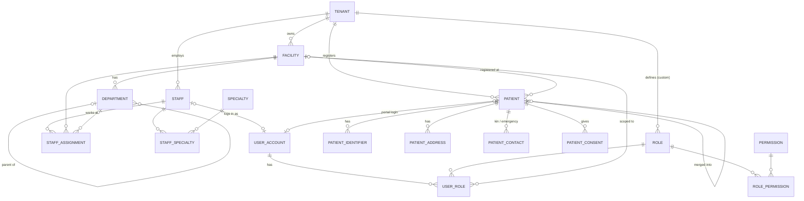

# Layer 1 — Foundation (v1.0, locked)

Target: PostgreSQL 18, multi-tenant SaaS, India (ABDM / GST / DPDP Act 2023).

## Global conventions (apply to every layer)

| Rule | Detail |
|---|---|
| Primary keys | `uuid DEFAULT uuidv7()` — time-ordered, index-friendly |
| Tenancy | Every tenant-owned table has `tenant_id uuid NOT NULL`; Row-Level Security policy `tenant_id = current_setting('app.tenant_id')::uuid` |
| Cross-tenant safety | FKs to tenant-owned tables are composite `(tenant_id, x_id)` → `(tenant_id, id)`; each table has `UNIQUE (tenant_id, id)` |
| Audit columns | `created_at timestamptz`, `created_by uuid`, `updated_at`, `updated_by`, `deleted_at` (soft delete) |
| Audit trail | Append-only `audit_log` (who, what, when, before/after JSONB) — DPDP accountability & medico-legal |
| Time | All timestamps `timestamptz` (UTC); facility `timezone` used for display/scheduling |
| Enums | Small fixed sets → `text` + `CHECK`; tenant-extensible lists → lookup tables |
| Aadhaar | **Not stored** (would require an Aadhaar Data Vault under UIDAI regulations); ABHA used instead |

## Diagram

## Tables

### Tenancy & organisation

**tenant** — a hospital group / customer (global, no RLS)
- `id`, `name`, `slug` UNIQUE, `legal_name`, `pan`, `status` CHECK (`trial`,`active`,`suspended`,`closed`), `plan_code`, `settings jsonb`

**facility** — a physical branch
- `id`, `tenant_id`, `code` (UNIQUE per tenant), `name`, `facility_type` CHECK (`hospital`,`clinic`,`diagnostic_centre`,`pharmacy`)
- `hfr_id` (ABDM Health Facility Registry, nullable, UNIQUE), `nabh_accreditation_no`
- `gstin` (nullable; GST is registered per state), `state_code char(2)` (GST state code, drives CGST+SGST vs IGST)
- `address_line1`, `address_line2`, `city`, `district`, `pincode`, `phone`, `email`, `timezone` DEFAULT `Asia/Kolkata`, `is_active`

**department**
- `id`, `tenant_id`, `facility_id`, `parent_id` (self-FK, nullable), `code` (UNIQUE per facility), `name`
- `kind` CHECK (`clinical`,`diagnostic`,`support`,`administrative`), `specialty_id` (nullable FK), `is_active`

**specialty** — global master (seeded, e.g. General Medicine, Cardiology)
- `id`, `code` UNIQUE, `name`, `parent_id`

### Staff

**staff**
- `id`, `tenant_id`, `employee_code` (UNIQUE per tenant), `title`, `first_name`, `middle_name`, `last_name`, `sex`, `dob`, `phone`, `email`
- `staff_type` CHECK (`doctor`,`nurse`,`technician`,`pharmacist`,`admin`,`support`,`other`)
- `hpr_id` (ABDM Healthcare Professional Registry; links same person across tenants — not unique globally by design, unique per tenant)
- `council_name` (e.g. NMC / state medical council / nursing council), `council_reg_no`, `council_reg_valid_till`
- `qualifications text[]`, `employment_type` CHECK (`full_time`,`part_time`,`visiting`,`contract`), `joined_on`, `left_on`, `is_active`

**staff_specialty** — `staff_id`, `specialty_id`, `is_primary`; PK (`staff_id`,`specialty_id`)

**staff_assignment** — where a staff member works (history kept)
- `id`, `tenant_id`, `staff_id`, `facility_id`, `department_id` (nullable), `designation`, `valid_from`, `valid_to` (nullable = current)
- Exclusion constraint: no overlapping ranges for same (`staff_id`,`facility_id`,`department_id`)

### Identity & access

**user_account**
- `id`, `tenant_id`, `staff_id` (nullable), `patient_id` (nullable)
- `CHECK (num_nonnulls(staff_id, patient_id) = 1)` — exactly one; each UNIQUE when not null
- `email citext`, `phone`, `password_hash` (argon2id), `mfa_enabled`, `mfa_secret_enc`, `status` CHECK (`invited`,`active`,`locked`,`disabled`), `last_login_at`, `failed_login_count`
- UNIQUE (`tenant_id`, `email`), UNIQUE (`tenant_id`, `phone`)

**permission** — fixed system list (global), e.g. `patient.read`, `prescription.sign`, `invoice.refund`
- `id`, `code` UNIQUE, `module`, `description`

**role**
- `id`, `tenant_id` (NULL = system default role, visible to all tenants), `code`, `name`, `is_system`, `cloned_from_id`
- UNIQUE (`tenant_id`, `code`); system roles read-only — tenants clone to customise

**role_permission** — `role_id`, `permission_id`; PK both

**user_role** — `id`, `tenant_id`, `user_id`, `role_id`, `facility_id` (NULL = all facilities in tenant), `valid_from`, `valid_to`

### Patient

**patient**
- `id`, `tenant_id`, `mrn` (UNIQUE per tenant; generated from a per-tenant sequence), `registered_facility_id`
- `title`, `first_name`, `middle_name`, `last_name`, `dob`, `dob_is_estimated bool`, `sex` CHECK (`male`,`female`,`other`,`unknown`)
- `phone`, `email`, `preferred_language`, `blood_group` CHECK (`A+`,`A-`,`B+`,`B-`,`AB+`,`AB-`,`O+`,`O-`), `marital_status`, `occupation`
- `is_vip`, `is_confidential` (restricts record visibility), `deceased_at`
- `merged_into_id` (self-FK, nullable) — a merged record is read-only and redirects
- Indexes: trigram on name, btree on `phone`, `dob`

**patient_identifier** — ABHA and others, one table instead of many columns
- `id`, `tenant_id`, `patient_id`, `type` CHECK (`abha_number`,`abha_address`,`pan`,`passport`,`voter_id`,`driving_licence`,`other`)
- `value`, `verified_at`, `verified_via` (e.g. `abdm_otp`), `is_primary`
- UNIQUE (`tenant_id`,`type`,`value`) for `abha_number` / `abha_address`

**patient_address** — `id`, `tenant_id`, `patient_id`, `type` (`home`,`work`,`temporary`), `line1`, `line2`, `city`, `district`, `state_code`, `pincode`, `is_primary`

**patient_contact** — next of kin / emergency / guardian (minors)
- `id`, `tenant_id`, `patient_id`, `relationship`, `name`, `phone`, `is_emergency`, `is_legal_guardian`, `related_patient_id` (nullable — if the contact is also a patient)

**patient_consent** — DPDP Act & ABDM consent records, plus clinical (informed) consents
- `id`, `tenant_id`, `patient_id`, `purpose` CHECK (`treatment`,`data_sharing_abdm`,`research`,`marketing`,`sms_whatsapp`,`admission`,`surgery`,`anaesthesia`,`blood_transfusion`,`high_risk_procedure`,`teleconsult`)
- `encounter_id` (nullable), `surgery_id` (nullable) — added in v1.1 for clinical consents (Layers 2–3)
- `signed_by` CHECK (`patient`,`guardian`,`legal_representative`), `signer_name`, `signer_relationship`, `witness_staff_id`
- `scope jsonb`, `abdm_consent_artefact_id` (nullable), `granted_at`, `expires_at`, `revoked_at`, `captured_by`, `evidence_document_id`

### Cross-cutting

**audit_log** (partitioned by month, append-only, no UPDATE/DELETE grants)
- `id`, `tenant_id`, `occurred_at`, `user_id`, `action` (`create`,`update`,`delete`,`view`,`export`,`login`), `entity_table`, `entity_id`, `before jsonb`, `after jsonb`, `ip`, `user_agent`, `reason`

## Decisions log
| # | Decision | Chosen |
|---|---|---|
| D1 | Tenancy model | Shared schema + RLS |
| D2 | MRN scope | One MRN per tenant, shared across branches |
| D3 | Patient portal | Yes — `user_account.patient_id` |
| D4 | Multi-tenant doctors | Separate staff row per tenant, linked by HPR ID |
| D5 | RBAC | System roles + tenant-cloned custom roles, fixed permission list |
