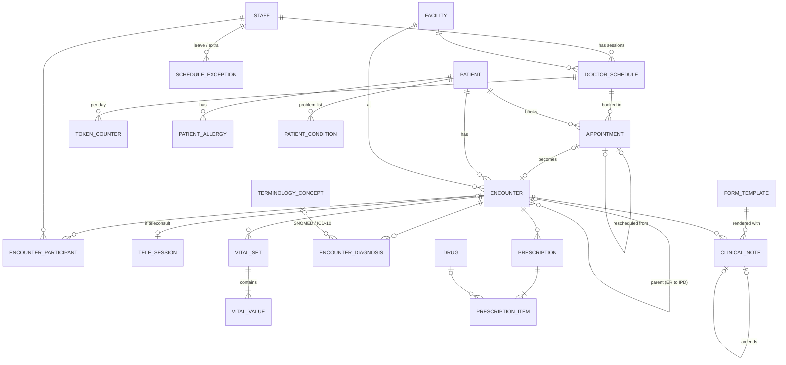

# Layer 2 — Scheduling, Encounters & OPD Clinical (v1.0)

Depends on: Layer 1. All global conventions from Layer 1 apply (UUIDv7, `tenant_id` + RLS, composite FKs, audit columns).

## Diagram

## Tables

### Scheduling

**doctor_schedule** — recurring weekly session template
- `id`, `tenant_id`, `facility_id`, `staff_id`, `department_id`
- `weekday smallint` CHECK 1–7 (ISO, 1 = Monday), `start_time time`, `end_time time` CHECK `end_time > start_time`
- `mode` CHECK (`in_person`,`tele`), `slot_minutes` (nullable = token-only session)
- `max_slot_bookings`, `max_walk_in_tokens`, `valid_from date`, `valid_to date`
- Slots are **computed** from template − exceptions − existing appointments; not materialised (avoids millions of empty rows and regeneration jobs).

**schedule_exception**
- `id`, `tenant_id`, `staff_id`, `facility_id` (nullable = all), `period tstzrange`
- `kind` CHECK (`leave`,`holiday`,`blocked`,`extra_session`), `reason`, `extra_session_template jsonb` (for `extra_session`)

**facility_holiday** — `id`, `tenant_id`, `facility_id`, `holiday_date`, `name`

**token_counter** — atomic daily token allocation
- PK (`tenant_id`, `schedule_id`, `session_date`), `last_token int`
- Allocated with `INSERT … ON CONFLICT DO UPDATE SET last_token = last_token + 1 RETURNING last_token` — no race between two front-desk counters

**appointment**
- `id`, `tenant_id`, `facility_id`, `patient_id`, `staff_id`, `department_id`, `schedule_id`, `session_date date`
- `booking_kind` CHECK (`slot`,`walk_in`)
- `slot tstzrange` (required when `slot`, NULL when `walk_in`), `token_no int` (every appointment gets a token so both kinds share one queue)
- `visit_type` CHECK (`new`,`follow_up`,`review`,`procedure`), `channel` CHECK (`front_desk`,`portal`,`phone`,`voice_agent`,`whatsapp`,`referral`)
- `status` CHECK (`booked`,`confirmed`,`checked_in`,`in_consultation`,`completed`,`cancelled`,`no_show`)
- Queue timestamps: `checked_in_at`, `called_at`, `consult_started_at`, `completed_at` (gives wait-time analytics free)
- `cancelled_reason`, `rescheduled_from_id` (self-FK), `priority` CHECK (`normal`,`senior_citizen`,`emergency`,`vip`)
- Constraints:
  - `EXCLUDE USING gist (tenant_id WITH =, staff_id WITH =, slot WITH &&) WHERE (status NOT IN ('cancelled','no_show') AND slot IS NOT NULL)` — needs `btree_gist`; no double-booking a doctor
  - UNIQUE (`tenant_id`,`schedule_id`,`session_date`,`token_no`)
  - CHECK ((`booking_kind`='slot') = (`slot` IS NOT NULL))

### Encounter hub

**encounter** — every patient contact; the FK hub for clinical, orders and billing
- `id`, `tenant_id`, `facility_id`, `patient_id`, `encounter_no` (UNIQUE per tenant, human-readable, e.g. `OP-2026-000123`)
- `encounter_class` CHECK (`opd`,`ipd`,`emergency`,`teleconsult`,`daycare`)
- `appointment_id` (nullable, UNIQUE), `department_id`, `attending_staff_id`
- `status` CHECK (`planned`,`in_progress`,`on_hold`,`finished`,`cancelled`,`entered_in_error`)
- `period tstzrange` (start required; open-ended while in progress)
- `chief_complaint text`, `referral_source` CHECK (`self`,`internal_doctor`,`external_doctor`,`camp`,`other`), `referred_by_name`, `referred_by_staff_id`
- `parent_encounter_id` (ER → IPD conversion), `follow_up_of_id`, `follow_up_advised_on date`
- Payer/billing context added in Layer 6 (`encounter_payer`)

**encounter_participant** — `id`, `tenant_id`, `encounter_id`, `staff_id`, `role` CHECK (`attending`,`consultant`,`resident`,`nurse`,`anaesthetist`,`other`), `period tstzrange`

**tele_session** — 1:1 with a teleconsult encounter
- `encounter_id` PK/FK, `tenant_id`, `provider` (video vendor), `room_ref`, `patient_identity_verified_by`, `consent_mode` CHECK (`implied`,`explicit`), `started_at`, `ended_at`, `recording_ref` (nullable)
- Rationale: Telemedicine Practice Guidelines (2020) require identity verification and consent and restrict which drug lists may be prescribed by teleconsult — the app enforces drug restrictions using `drug.tele_prescribable` below.

### Terminology (global, no RLS, read-only to tenants)

**terminology_concept**
- `id`, `system` CHECK (`snomed_ct`,`icd10`,`loinc`,`ucum`), `code`, `display`, `version`, `is_active`, `parent_codes text[]`
- UNIQUE (`system`,`code`,`version`); trigram index on `display` for search
- ICD-10 = WHO edition (used in India), not the US ICD-10-CM
- SNOMED CT India Edition loaded from NRCeS releases

**concept_map** — SNOMED → ICD-10 map (for claims): `source_concept_id`, `target_concept_id`, `map_priority`, `map_rule`

### Clinical data

**vital_set** — one capture event: `id`, `tenant_id`, `encounter_id`, `patient_id`, `recorded_at`, `recorded_by`, `position`, `notes`

**vital_value** — narrow (one row per measurement)
- `id`, `tenant_id`, `vital_set_id`, `code` (LOINC, e.g. 8480-6 systolic BP), `value_numeric numeric`, `unit` (UCUM), `is_abnormal`
- UNIQUE (`vital_set_id`,`code`). Narrow form lets IPD charting add new parameters (GRBS, pain score, GCS) without migrations.

**encounter_diagnosis**
- `id`, `tenant_id`, `encounter_id`, `patient_id`
- `snomed_concept_id` (nullable), `icd10_concept_id` (nullable), `free_text` (nullable)
- CHECK `num_nonnulls(snomed_concept_id, icd10_concept_id, free_text) >= 1`
- `diagnosis_type` CHECK (`provisional`,`differential`,`final`,`discharge`), `is_primary`, `rank`, `onset_date`, `recorded_by`, `recorded_at`
- Partial UNIQUE: one `is_primary` per (`encounter_id`,`diagnosis_type`)

**patient_allergy** — patient-level (not encounter), drives pharmacy alerts
- `id`, `tenant_id`, `patient_id`, `category` CHECK (`drug`,`food`,`environment`,`other`), `allergen_concept_id`, `allergen_drug_id`, `allergen_text`
- `reaction`, `severity` CHECK (`mild`,`moderate`,`severe`), `status` CHECK (`active`,`inactive`,`refuted`), `recorded_by`, `recorded_at`
- Special row type: `no_known_allergies` flag on `patient` (`nka_confirmed_at`) — distinguishes "none" from "not asked"

**patient_condition** — longitudinal problem list (diabetes, hypertension…)
- `id`, `tenant_id`, `patient_id`, `concept_id`, `free_text`, `clinical_status` CHECK (`active`,`remission`,`resolved`), `onset_date`, `abatement_date`, `source_encounter_id`

**form_template** — versioned JSONB form definitions
- `id`, `tenant_id` (NULL = system template), `code`, `version int`, `name`, `specialty_id`, `note_type`
- `schema jsonb` (JSON Schema for data), `ui_schema jsonb`, `status` CHECK (`draft`,`published`,`retired`)
- UNIQUE (`tenant_id`,`code`,`version`); published versions immutable

**clinical_note**
- `id`, `tenant_id`, `encounter_id`, `patient_id`, `note_type` CHECK (`history`,`examination`,`progress`,`procedure`,`consult`,`nursing`,`discharge_summary`)
- `template_id` (pins exact version), `data jsonb` (validated against template schema), `narrative text`
- `author_id`, `status` CHECK (`draft`,`signed`,`amended`,`entered_in_error`), `signed_at`, `amends_note_id` (self-FK)
- **Signed notes are immutable** (trigger blocks UPDATE once `signed`); corrections create an amendment row — medico-legal requirement
- GIN index on `data` for querying template fields

### Medication & prescribing

**drug** — catalogue only (stock, batches, pricing in Layer 5)
- `id`, `tenant_id` (NULL = global master, tenant rows = local formulary additions)
- `generic_name` (required), `brand_name`, `strength`, `dosage_form` CHECK (`tablet`,`capsule`,`syrup`,`injection`,`ointment`,`drops`,`inhaler`,`other`), `default_route`
- `manufacturer`, `regulatory_schedule` CHECK (`none`,`G`,`H`,`H1`,`X`) — Drugs & Cosmetics Rules; H1/X need register-keeping in Layer 5
- `is_narcotic` (NDPS), `tele_prescribable` CHECK (`list_o`,`list_a`,`list_b`,`prohibited`), `snomed_concept_id`, `is_active`

**prescription**
- `id`, `tenant_id`, `encounter_id`, `patient_id`, `prescriber_id`, `prescribed_at`, `status` CHECK (`draft`,`signed`,`cancelled`), `advice text`, `valid_until`
- Immutable once signed (same rule as notes)

**prescription_item**
- `id`, `tenant_id`, `prescription_id`, `line_no`, `drug_id` (nullable), `generic_name` (snapshot, required), `brand_name` (snapshot)
- `dose numeric`, `dose_unit`, `route`, `frequency_code` CHECK (`OD`,`BD`,`TDS`,`QID`,`HS`,`SOS`,`STAT`,`Q4H`,`Q6H`,`Q8H`,`WEEKLY`,`CUSTOM`), `frequency_text`
- `duration_value int`, `duration_unit` CHECK (`days`,`weeks`,`months`,`continuous`), `quantity numeric`
- `food_relation` CHECK (`before_food`,`after_food`,`with_food`,`empty_stomach`,`any`), `instructions`, `substitution_allowed bool`
- Snapshot columns preserve exactly what was prescribed even if the catalogue changes later.

## Decisions log
| # | Decision | Chosen |
|---|---|---|
| D6 | Encounter model | Unified hub; IPD detail 1:1 in Layer 3 |
| D7 | OPD booking | Slots + walk-in tokens in one queue |
| D8 | Coding | SNOMED CT (clinical) + WHO ICD-10 (claims/reporting), LOINC for vitals/labs |
| D9 | Notes | Hybrid: core tables + versioned JSONB templates |
| D10 | Slots | Computed, not materialised |
| D11 | Drug catalogue | Defined here (prescribing needs it); stock in Layer 5 |
