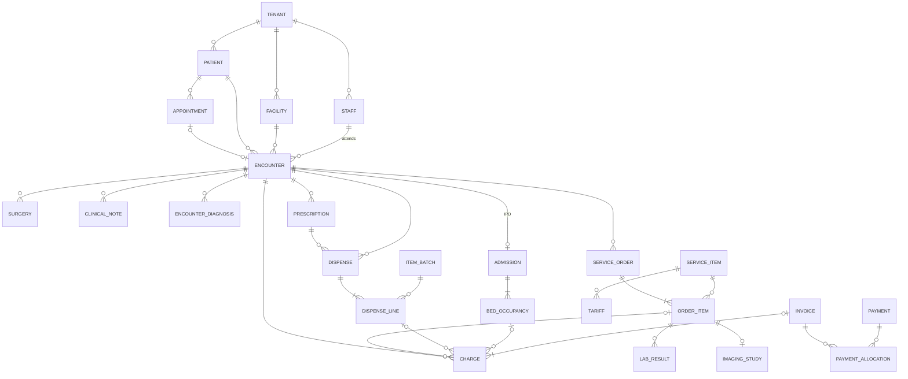

# Hospital Management System — Database ERD

Fresh design, built bottom-up. PostgreSQL 18 · multi-tenant SaaS (shared schema + Row-Level Security) · India (ABDM, GST, DPDP Act 2023).

| Layer | File | Covers |
|---|---|---|
| 1 | [01-foundation.md](01-foundation.md) | Global conventions, tenants, facilities, departments, staff, users/RBAC, patients, consent, documents, audit |
| 2 | [02-scheduling-opd.md](02-scheduling-opd.md) | Doctor schedules, slots + tokens, **encounter hub**, vitals, diagnoses (SNOMED/ICD-10), notes, drug catalogue, prescriptions |
| 3 | [03-ipd-ot-emergency.md](03-ipd-ot-emergency.md) | Wards/beds, admission, bed history, bed-day rules, OT, triage, MLC, birth & death records |
| 4 | [04-orders-diagnostics.md](04-orders-diagnostics.md) | Service catalogue, CPOE orders, specimens, lab results/reports, radiology + PACS, PC-PNDT Form F |
| 5 | [05-pharmacy-inventory.md](05-pharmacy-inventory.md) | Items, batches, serials, stores, stock ledger, indents/transfers, dispensing, pricing rules |
| 6 | [06-billing.md](06-billing.md) | Tariffs, GST rules, packages, charges, invoices, credit notes, payments, deposits, accounting export |

## How the layers connect

`encounter` (Layer 2) and `service_item` (Layer 4) are the two hubs everything hangs from.

## Design principles applied throughout
1. **Tenant isolation in the database**, not just the app: RLS + composite `(tenant_id, id)` foreign keys.
2. **Invariants as constraints**: exclusion constraints stop double-booked doctors, beds and OTs; partial unique indexes stop double charging; CHECKs cap prices at MRP.
3. **Clinical & financial records are immutable once signed/finalised** — corrections are new rows (amendments, report versions, credit notes).
4. **Snapshots over joins for history**: prescriptions, results, charges and invoices store what was true at the time.
5. **Regulation as data**: GST rates, bed-day rules and pricing are configurable tables with validity dates.
6. **Derive, don't duplicate**: bed occupancy, stock registers and interim bills are views/queries over source tables.

## Decisions log (all layers)
| # | Decision | Chosen |
|---|---|---|
| D1 | Tenancy | Shared schema + RLS |
| D2 | MRN | One per tenant, shared across branches |
| D3 | Patient portal | Yes |
| D4 | Doctors across tenants | Separate staff row per tenant, linked by HPR ID |
| D5 | RBAC | System roles + tenant custom roles |
| D6 | Encounter | Unified hub for OPD/IPD/ER/tele |
| D7 | OPD booking | Slots + walk-in tokens |
| D8 | Coding | SNOMED CT + WHO ICD-10 + LOINC |
| D9 | Notes | Core tables + versioned JSONB templates |
| D10 | Slots | Computed, not materialised |
| D11 | Drug catalogue | Layer 2; stock in Layer 5 |
| D12 | Bed-day counting | Configurable |
| D13 | OT | In scope |
| D14 | Nursing | Notes + vitals; MAR deferred |
| D15 | Emergency | Colour triage + MLC |
| D16 | Bed occupancy | Derived from history |
| D17 | Orders | Unified CPOE; `service_item` = billing master |
| D18 | Lab analysers | Manual now, interface-ready |
| D19 | Outsourced lab | Not modelled |
| D20 | Radiology | Reports + PACS references |
| D21 | Results | Snapshots + versioned reports |
| D22 | Inventory | Pharmacy + all consumables |
| D23 | Procurement | Deferred; minimal goods receipt |
| D24 | Drug pricing | Per item group: MRP − discount or cost + markup |
| D25 | Dispensing | Registered patients only |
| D26 | Stock | Ledger + balance, base units, FEFO |
| D27 | Payers | Self-pay only (insurance deferred) |
| D28 | Tariff | Plan × service × bed category × doctor |
| D29 | Tax | GST as data |
| D30 | Packages | Inclusions + limits |
| D31 | Accounting | Export, no GL |
| D32 | Invoice numbering | Per GSTIN per FY at finalisation |

## Deferred backlog
- Medication Administration Record (MAR), intake/output, care plans
- Procurement: PR → PO → approval → vendor invoice → vendor returns/payments
- Walk-in OTC pharmacy sales
- Outsourced/reference lab tracking
- Insurance/TPA, government schemes, corporate credit, pre-auth & claims (NHCX)
- ABDM HIP/HIU integration tables (care-context linking, health-record exchange logs)
